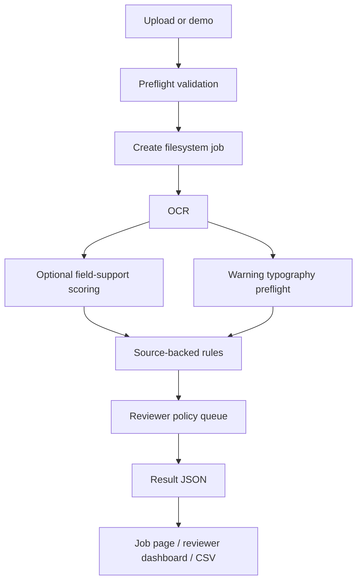
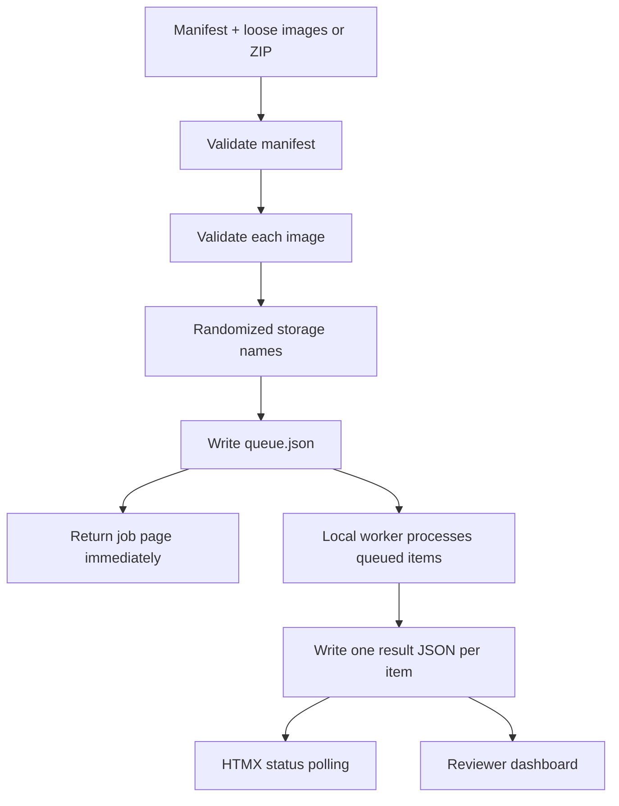

# Architecture

Labels On Tap is a single-VM, local-first web application for COLA-style alcohol
label preflight.

## Runtime Stack

| Layer | Technology | Purpose |
|---|---|---|
| Web | FastAPI | Routes, uploads, health checks |
| UI | Jinja2 + HTMX | Server-rendered pages and polling |
| Styling | Local CSS | No frontend build or CDN dependency |
| OCR | docTR + fixture fallback | Real upload OCR plus deterministic demos/tests |
| Evidence model | Optional DistilRoBERTa | Field-support scoring |
| Typography model | JSON logistic classifier | Warning-heading boldness preflight |
| Rules | Python deterministic rules | Source-backed compliance triage |
| Queue | Filesystem JSON + local worker | Durable single-VM batch processing |
| Storage | Filesystem JSON | Jobs, uploads, results, reviewer notes |
| Deployment | Docker Compose + Caddy | Public HTTPS at `www.labelsontap.ai` |

## Request Flow



## Batch Flow



The queue is durable at the filesystem level. If the app restarts while a batch
is marked `running`, startup recovery puts it back into `queued`.

## Filesystem Layout

```text
data/jobs/{job_id}/
  manifest.json
  queue.json                 # batch jobs only
  uploads/
  results/
```

Raw/bulk evaluation data is intentionally gitignored:

```text
data/work/
```

## Security Boundaries

Implemented prototype controls:

- upload size limits,
- manifest size limits,
- ZIP archive size and item count limits,
- image extension allowlist,
- magic-byte checks,
- Pillow decode checks,
- randomized stored filenames,
- original filename kept only as metadata,
- path traversal rejection,
- no hosted OCR or hosted ML APIs at runtime.

Production controls still needed:

- authentication and roles,
- admin portal,
- audit logs,
- retention policy,
- malware scanning/quarantine,
- rate limiting,
- central logging/monitoring,
- formal accessibility/security review.

## Deployment

```text
Browser
  -> Caddy HTTPS
  -> FastAPI app container
  -> local OCR/models/rules
  -> filesystem job volume
```

Canonical host:

```text
https://www.labelsontap.ai
```

Apex redirect:

```text
https://labelsontap.ai -> https://www.labelsontap.ai
```

## Production Upgrade Path

- Replace local queue with broker-backed worker queue.
- Add PostgreSQL for review history and audit metadata.
- Add SSO/RBAC.
- Add malware scanning and retention policy.
- Promote graph/CNN model candidates only after locked noisy-OCR holdout
  evaluation and CPU latency proof.
