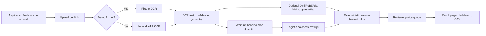
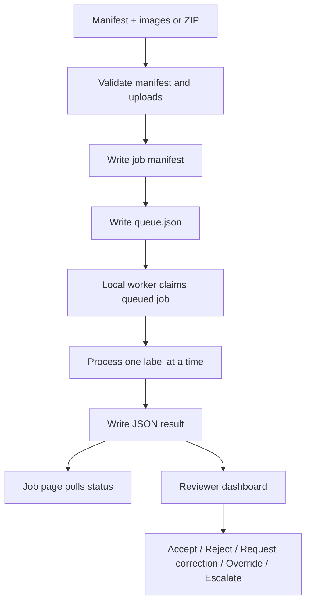
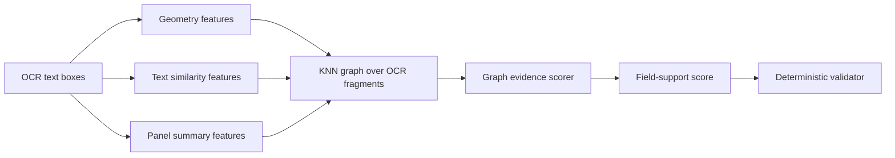
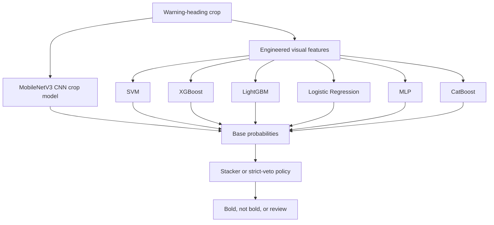
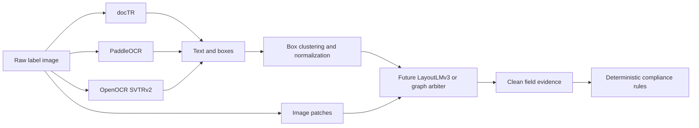

# Model Architecture

This document describes the actual runtime model path and the offline promotion
candidates.

## Runtime Pipeline



## Components

| Component | Runtime status | Purpose |
|---|---|---|
| Fixture OCR | Active | Deterministic demos/tests |
| docTR OCR | Active | Local OCR for real uploads |
| DistilRoBERTa field support | Optional active | Scores whether candidate text supports target fields |
| Logistic boldness model | Active | Conservative `GOVERNMENT WARNING:` heading boldness check |
| Deterministic rules | Active | Final compliance triage |
| Reviewer queues | Active | Human workflow routing |
| Graph scorer | Offline only | Future post-OCR evidence scorer |
| CNN typography ensembles | Offline only | Future warning-heading classifier candidates |

## DistilRoBERTa Field Support

The field-support model is a text-pair classifier:

```text
field name
expected application value
candidate OCR/application text
product type / import context
  -> supported / not supported
```

Current artifact location:

```text
data/work/field-support-models/distilroberta-field-support-v1-runtime/model/
```

This artifact is gitignored. Docker Compose mounts it at:

```text
/app/models/field_support/distilroberta
```

Measured clean text-pair results:

| Split | Examples | F1 | False-clear rate |
|---|---:|---:|---:|
| Train | 31,008 | 1.000000 | 0.000000 |
| Validation | 15,417 | 1.000000 | 0.000000 |
| Locked holdout | 46,992 | 0.999904 | 0.000096 |

Important caveat: this run used clean weak-supervision pairs from accepted
public COLA fields. It does not prove final OCR extraction accuracy.

## Typography Boldness Model

The deployed boldness model is intentionally classical:

```text
OCR geometry
  -> warning-heading crop
  -> engineered visual features
  -> logistic classifier exported as JSON
  -> pass only when confidence >= 0.9546
```

Runtime artifact:

```text
app/models/typography/boldness_logistic_v1.json
```

Measured operating point:

| Metric | Value |
|---|---:|
| Validation false-clear rate | 0.000624 |
| Synthetic holdout false-clear rate | 0.001800 |
| Held-out approved-COLA clear rate | 92.19% |
| Real COLA sanity latency | about 37 ms crop + classify |

Cases below threshold route to review. The model does not make final rejection
decisions.

## Batch and Review Flow



## Offline Promotion Candidates

### Graph-Aware Evidence Scorer

The graph scorer is the smallest practical version of the larger curved-text
idea. It does not read pixels. It consumes OCR fragments, geometry, and expected
field values, then decides whether the fragments support the field.



Proof of concept:

| Model | F1 | False-clear rate |
|---|---:|---:|
| Baseline fuzzy matcher | 0.7714 | 0.0439 |
| Graph-aware scorer POC | 0.8489 | 0.0175 |

Promotion requirements:

- saved runtime artifact,
- runtime graph feature conversion,
- same-split comparison against DistilRoBERTa,
- CPU latency measurement,
- tests,
- locked noisy-OCR holdout evaluation.

### CNN-Inclusive Typography Ensembles

The typography ensemble path is a future replacement candidate for the current
logistic warning-heading preflight. The current runtime uses the smaller
logistic model; the ensemble requires one more promotion pass before it should
ship.



Best offline candidates:

| Model / Policy | Test macro F1 | Test false-clear |
|---|---:|---:|
| MobileNetV3 CNN base | 0.9686 | 0.0055 |
| Logistic stacker, all bases + CNN | 0.9908 | 0.0099 |
| LightGBM reject, all bases + CNN | 0.9552 | 0.0033 |
| XGBoost reject, all bases + CNN | 0.9656 | 0.0044 |

Promotion requirements:

- export artifact,
- wire into runtime typography interface,
- compare against current logistic preflight on same locked split,
- confirm CPU latency inside the deployment container,
- keep conservative review routing for uncertain cases.

### Future Tri-Engine OCR and Layout Arbiter

The most ambitious future path treats OCR engines as noisy sensors and uses a
spatial arbiter only after proper labels, clustering, and locked-holdout testing
exist.



Promotion requirements:

- token-level or weak labels that have been manually audited,
- overlap/IoU clustering for conflicting OCR boxes,
- validation tuning for low false-clear rate,
- locked noisy-OCR holdout benchmark,
- CPU latency proof on the deployment class,
- feature flag and rollback path.
