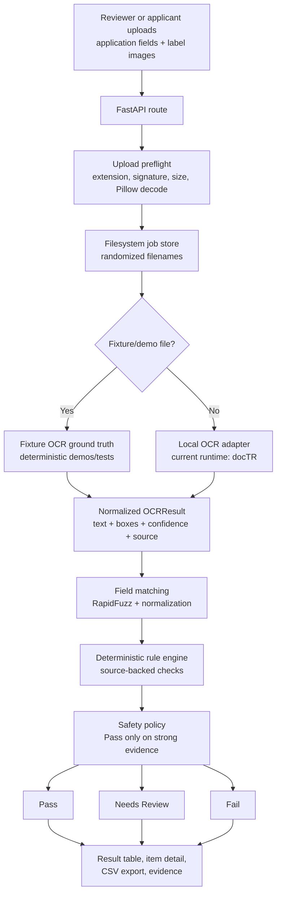
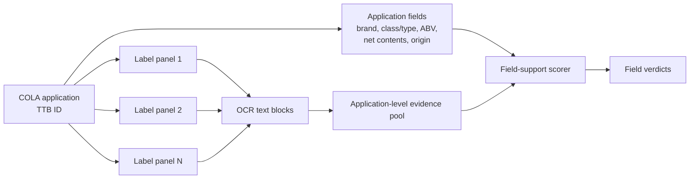
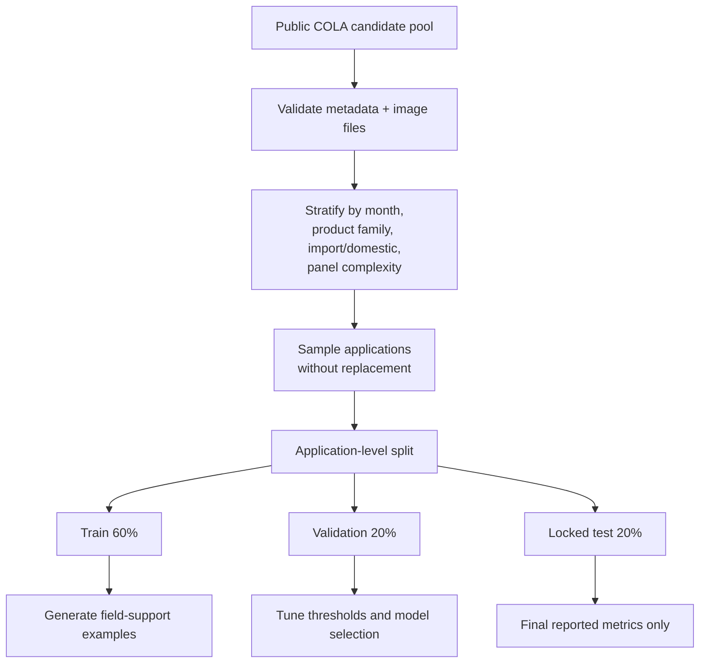
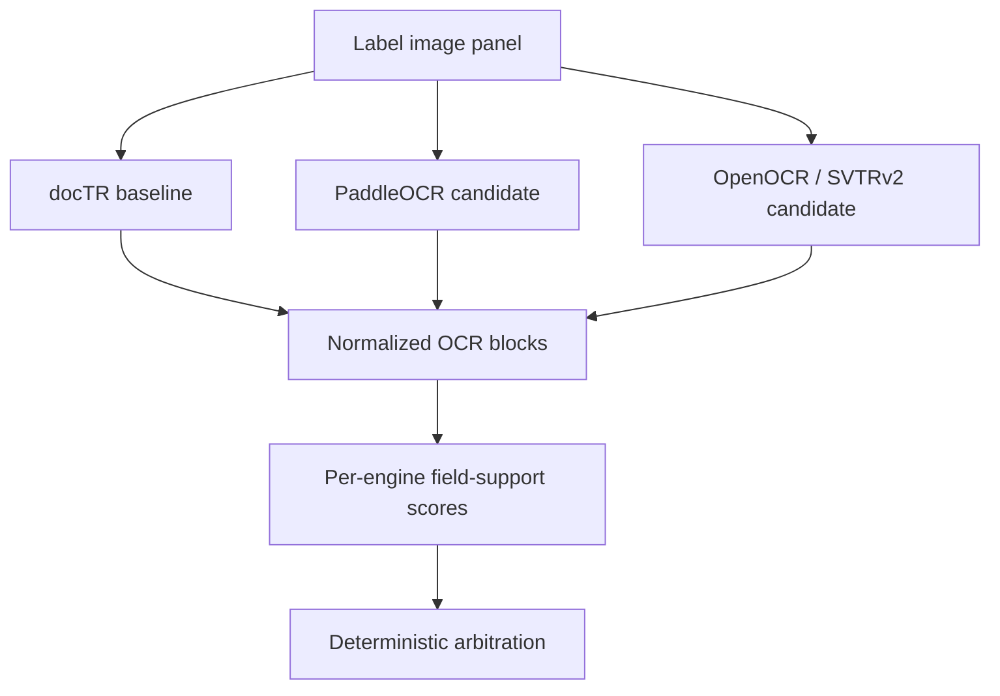
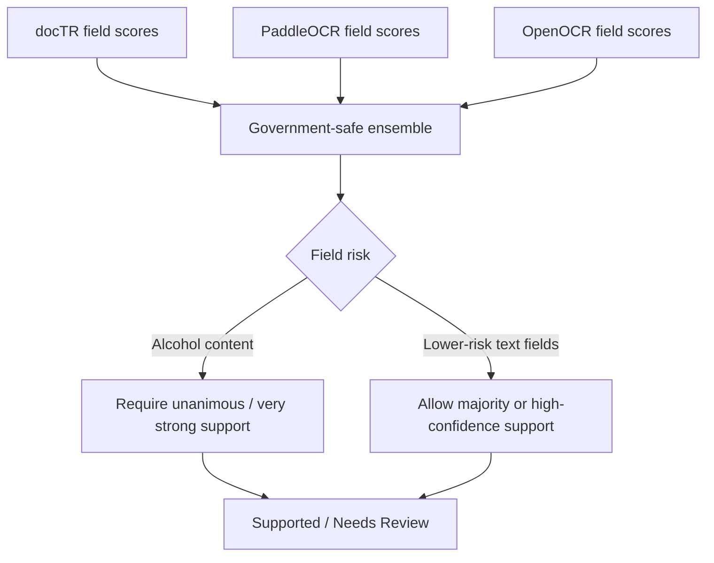
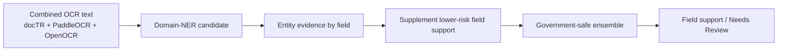
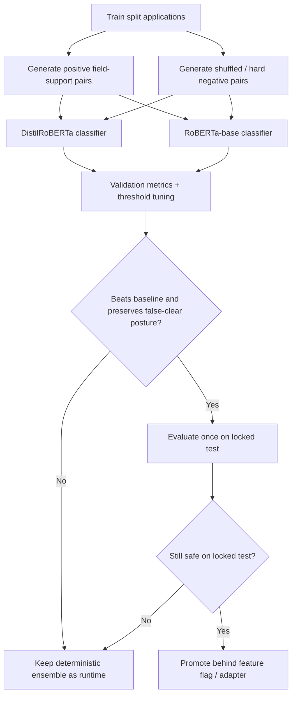
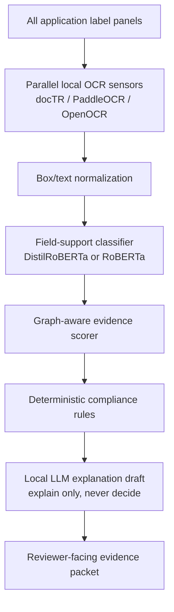

# MODEL_ARCHITECTURE.md - Labels On Tap Model Architecture

**Project:** Labels On Tap
**Canonical URL:** `https://www.labelsontap.ai`
**Last updated:** May 3, 2026

This document explains the current and planned model architecture from raw COLA
application data through OCR, field matching, deterministic compliance scoring,
and final reviewer-facing verdicts.

The short version:

```text
COLAs Online-style application data
  + all submitted label-artwork panels for that application
  -> local OCR evidence
  -> field-support scoring
  -> deterministic safety policy
  -> Pass / Needs Review / Fail with evidence
```

The deployed prototype is intentionally conservative. It does not use hosted OCR
or hosted ML APIs, and it does not let a language model decide compliance.

---

## 1. Product Objective

Labels On Tap is designed to triage COLAs Online-style alcohol label submissions
and identify labels that appear out of compliance or do not match the submitted
application data.

The model problem is not "approve labels automatically." The model problem is:

```text
Given accepted application fields and submitted label artwork,
can the system find enough label evidence to support those fields?
```

That keeps the architecture auditable:

- OCR extracts text evidence from label images.
- Field-support logic compares OCR evidence to application fields.
- Rules and safety policy decide whether evidence is strong, missing, or
  contradictory.
- Human reviewers get the evidence and reviewer action.

---

## 2. End-To-End Runtime Flow



Current deployed runtime:

| Layer | Runtime Choice |
|---|---|
| Web app | FastAPI |
| UI | Jinja2 + HTMX + local CSS |
| Storage | Filesystem JSON job/result store |
| OCR | docTR for real uploads, fixture OCR for deterministic demos |
| Matching | RapidFuzz and source-backed deterministic checks |
| Deployment | Docker Compose + Caddy on AWS Lightsail |

The deployed app is stable and intentionally does not yet depend on heavy
experimental OCR or Transformer models.

---

## 3. Data Inputs

There are three separate data classes. They must stay separate.

| Data Class | Purpose | Runtime Dependency | Storage |
|---|---|---:|---|
| User/demo uploads | Actual app workflow and one-click demos | Yes | `data/jobs/` at runtime |
| Synthetic fixtures | Known Pass/Needs Review/Fail regression tests | Yes for demos/tests | `data/fixtures/demo/` |
| Official public COLA examples | OCR and field-matching evaluation corpus | No | gitignored `data/work/` |

The official public COLA examples are used for evaluation, not runtime. The app
should be able to run without COLA Cloud, TTB registry scraping, or any hosted
data service. The current measured OCR/model calibration set is COLA
Cloud-derived public COLA data because the direct TTB attachment endpoint was
unstable during the sprint. The direct TTB Public COLA Registry parser remains
the official printable-form path, but those direct attachment downloads are not
the source of the current model metrics.

### Multi-Panel Application Contract

One COLA application can include multiple label-artwork panels:

```text
front label
back label
neck label
keg collar
government warning panel
other affixed materials
```

For field matching, the application is the unit of analysis. All valid label
images associated with one application must be OCR'd and pooled before deciding
whether the label artwork supports an application field.



---

## 4. Official Evaluation Corpus

The evaluation corpus should be built from accepted public COLA records because
they provide a safe public proxy for the form-data-to-label-artwork matching
task.

The planned design is a locked application-level split:

```text
60% train
20% validation
20% locked test
```

The split must happen at the COLA application level before field-pair examples
are generated. This prevents leakage where the same TTB ID, brand, producer, or
OCR text appears in both training and test examples.



The validation set is used for:

- threshold selection,
- model-family selection,
- safety policy tuning,
- preprocessing decisions.

The locked test set is used once after those settings are frozen.

After final test reporting, a production model may be retrained on train plus
validation, or eventually on all approved labeled internal data, but the
reported performance estimate must remain tied to the untouched locked test.

---

## 5. OCR Layer

The OCR layer reads image pixels and emits normalized evidence:

```text
text
bounding boxes / polygons where available
confidence where available
source engine
timing
```

Current and tested OCR paths:

| OCR Path | Status | Decision |
|---|---|---|
| docTR | Deployed baseline | Keep stable runtime path |
| PaddleOCR | 30-image smoke: higher F1, higher false-clear rate | Still in contention, needs larger calibration |
| OpenOCR / SVTRv2 | 30-image smoke: fastest complete OCR candidate | Still in contention, needs larger calibration |
| PARSeq / ASTER / ABINet over crops | Fast recognizer-stage experiments | Pruned from runtime promotion in current crop contract |
| FCENet + ASTER | Arbitrary-shape detector experiment | Pruned for CPU latency and low F1 in smoke |



The Monday runtime should not switch OCR engines just because a smoke test looks
interesting. An OCR candidate must win on a larger calibration set and preserve
the false-clear posture before promotion.

---

## 6. Field-Support Scoring

Field-support scoring asks a narrow question:

```text
Does OCR evidence support this expected application field?
```

Target fields:

| Field | Why It Matters |
|---|---|
| Brand name | Common agent matching task |
| Fanciful name | Common label/application text field |
| Class/type | Required designation, currently difficult |
| Alcohol content | High-value numeric field |
| Net contents | Required label element |
| Country of origin | Required for imports |
| Applicant/producer/bottler | Useful but visibility is inconsistent |

The current deterministic scorer uses normalization, RapidFuzz matching, and
source-backed rules. It is intentionally asymmetric:

```text
strong support     -> field supported
weak/missing OCR   -> Needs Review
clear contradiction -> Fail or Fail Candidate
```

---

## 7. Government-Safe Ensemble Policy

The current best pure OCR ensemble treats docTR, PaddleOCR, and OpenOCR as noisy
sensors. It combines their field-support scores with extra caution on high-risk
fields.



Measured smoke result:

| Policy | F1 | False-Clear Rate | Decision |
|---|---:|---:|---|
| Naive any-engine support | 0.7459 | 0.0357 | Pruned as unsafe |
| Government-safe OCR ensemble | 0.7416 | 0.0000 | Best pure OCR smoke result |

The small F1 sacrifice is acceptable because it removes false clears in the
first shuffled-negative smoke.

---

## 8. Domain-NER / BERT Arbiter Experiments

Post-OCR Transformer models are being tested as arbiters, not as OCR engines and
not as compliance decision makers.



Measured smoke results:

| Candidate | Entity-Only F1 | Hybrid F1 | False-Clear Rate | Decision |
|---|---:|---:|---:|---|
| WineBERT/o labels | 0.4865 | 0.7416 | 0.0000 | Not promoted; no lift, unknown license, wine-only coverage |
| WineBERT/o NER | 0.1176 | 0.7416 | 0.0000 | Not promoted |
| OSA market-domain NER | 0.5166 | 0.7486 | 0.0000 | Promising; needs 100-app calibration |
| FoodBaseBERT-NER | 0.0522 | 0.7416 | 0.0000 | Pruned; wrong semantic domain |

OSA is the current best BERT-assisted smoke result, but its lift was one extra
true positive across `224` field-support examples. That earns a larger
calibration run, not automatic deployment.

---

## 9. Trainable Field-Support Classifier

The next serious supervised model should be a field-support classifier, not a
token-level NER model.

Why:

- public COLA data gives application fields and accepted label images,
- it does not give gold token-level spans,
- field-support classification directly matches the product problem,
- it is easier to weak-label without pretending we have human span labels.

Training example shape:

```text
Input:
  field_name
  expected application value
  OCR candidate text or OCR evidence window
  optional engine scores/confidence/source

Output:
  supports_field = yes/no
```

Example positive:

```text
FIELD: alcohol_content
EXPECTED: 45% Alc./Vol. (90 Proof)
OCR TEXT: OLD TOM DISTILLERY ... 45% Alc./Vol. ... 750 mL
LABEL: supports
```

Example negative:

```text
FIELD: alcohol_content
EXPECTED: 13.5% Alc./Vol.
OCR TEXT: OLD TOM DISTILLERY ... 45% Alc./Vol. ... 750 mL
LABEL: does_not_support
```

Recommended training order:

```text
1. DistilRoBERTa field-support classifier
2. RoBERTa-base field-support classifier
3. DistilRoBERTa / RoBERTa + government-safe ensemble
```



The classifier is allowed to improve recall only if it does not create an
unacceptable false-clear rate. For this project, the false-clear metric is more
important than headline F1.

---

## 10. Metrics And Gates

Primary safety metric:

| Metric | Meaning |
|---|---|
| False-clear rate | Known bad or shuffled-negative examples incorrectly treated as supported/pass |

Secondary metrics:

| Metric | Meaning |
|---|---|
| Field-support F1 | Balance of support precision and recall |
| Recall | How often true field evidence is found |
| Precision | How often supported fields are actually supported |
| Reviewer-escalation rate | How much uncertainty routes to Needs Review |
| Application-level pass/review/fail distribution | How the full triage behaves |
| Per-application latency | Whether it stays near stakeholder tolerance |

Promotion gate:

```text
candidate model can be promoted only if:
  validation F1 improves over baseline
  validation false-clear rate is acceptable
  locked-test false-clear rate remains acceptable after freeze
  CPU latency fits the deployment target
  runtime has a rollback path
```

---

## 11. Final Runtime Recommendation

For the take-home submission, the safest runtime posture is:

```text
Deployed app:
  docTR or fixture OCR
  deterministic field matching
  source-backed rules
  conservative Needs Review fallback

Experimental evidence:
  PaddleOCR/OpenOCR/ensemble/BERT results documented
  OSA and field-support classifier path ready for calibration
```

Do not merge a trained RoBERTa or DistilRoBERTa model into the public runtime
unless it clears the validation and locked-test gates. A measured, conservative
system is stronger than an impressive model that overfits or false-clears
problematic labels.

---

## 12. Future Architecture

If time and data permit after the current sprint:



A custom HO-GNN/TPS/SVTR curved-text vision model remains a future research
path. It should only be pursued if mature OCR engines and post-OCR arbitration
plateau because OCR fails to detect text in the first place.
