# MODEL_ARCHITECTURE.md - Labels On Tap Model Architecture

**Project:** Labels On Tap
**Canonical URL:** `https://www.labelsontap.ai`
**Last updated:** May 3, 2026

This document explains the current and planned model architecture from raw COLA
application data through OCR, field matching, deterministic compliance scoring,
and final reviewer-facing verdicts.

The short version:

```text
COLAs Online-style application data
  + all submitted label-artwork panels for that application
  -> local OCR evidence
  -> field-support scoring
  -> deterministic safety policy
  -> raw Pass / Needs Review / Fail with evidence
  -> human-review policy routing
```

The deployed prototype is intentionally conservative. It does not use hosted OCR
or hosted ML APIs, and it does not let a language model decide compliance.

---

## 1. Product Objective

Labels On Tap is designed to triage COLAs Online-style alcohol label submissions
and identify labels that appear out of compliance or do not match the submitted
application data.

The model problem is not "approve labels automatically." The model problem is:

```text
Given accepted application fields and submitted label artwork,
can the system find enough label evidence to support those fields?
```

That keeps the architecture auditable:

- OCR extracts text evidence from label images.
- Field-support logic compares OCR evidence to application fields.
- Rules and safety policy decide whether evidence is strong, missing, or
  contradictory.
- Human reviewers get the evidence and reviewer action.
- Agency policy decides whether candidate acceptances, candidate rejections, or
  both require reviewer confirmation before final action.

---

## 2. End-To-End Runtime Flow

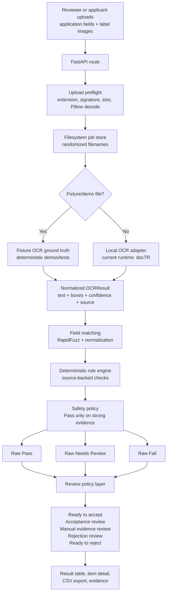

### 2.1 Human-Review Policy Layer

The model stack should not collapse evidence scoring and final agency action
into one decision. The planned review-policy layer applies a simple control
board after the raw verdict is computed:

```text
Send unknown government-warning cases to human review: Yes / No
Require reviewer approval before rejection: Yes / No
Require reviewer approval before acceptance: Yes / No
```

Default posture:

```text
Unknown government warning human review: No
Before rejection: No
Before acceptance: No
```

Routing:

| Raw system result | Policy result |
|---|---|
| Pass + acceptance review off | Ready to accept |
| Pass + acceptance review on | Acceptance review |
| Fail + rejection review off | Ready to reject |
| Fail + rejection review on | Rejection review |
| Government warning unknown + warning review off | Fail, then normal fail routing |
| Government warning unknown + warning review on | Manual evidence review |
| Needs Review | Manual evidence review |

Unknown government-warning evidence is treated specially because the warning is
mandatory. If the reviewer does not opt into human review for that unknown
state, the system should default to failure instead of silently clearing the
label.

Reviewer actions remain separate from model outputs:

```text
Accept
Reject
Request correction / better image
Override with note
Escalate
```

This is the right architecture for batch review: the model stack triages and
explains; the policy layer decides how much human confirmation is required.

Current deployed runtime:

| Layer | Runtime Choice |
|---|---|
| Web app | FastAPI |
| UI | Jinja2 + HTMX + local CSS |
| Storage | Filesystem JSON job/result store |
| OCR | docTR for real uploads, fixture OCR for deterministic demos |
| Matching | RapidFuzz and source-backed deterministic checks |
| Deployment | Docker Compose + Caddy on AWS Lightsail |

The deployed app is stable and intentionally does not yet depend on heavy
experimental OCR or Transformer models.

---

## 3. Data Inputs

There are three separate data classes. They must stay separate.

| Data Class | Purpose | Runtime Dependency | Storage |
|---|---|---:|---|
| User/demo uploads | Actual app workflow and one-click demos | Yes | `data/jobs/` at runtime |
| Photo intake uploads | Demonstration-only OCR extraction from free-form bottle/can/shelf photos | Yes for demo | `data/jobs/` at runtime |
| Local public example demo | Side-by-side application-field/OCR evidence comparison from COLA Cloud-derived public records | Local demo only | `data/work/cola/` input, `data/jobs/` display copy |
| Synthetic fixtures | Known Pass/Needs Review/Fail regression tests | Yes for demos/tests | `data/fixtures/demo/` |
| Official public COLA examples | OCR and field-matching evaluation corpus | No | gitignored `data/work/` |

The official public COLA examples are used for evaluation, not runtime. The app
should be able to run without COLA Cloud, TTB registry scraping, or any hosted
data service. The current measured OCR/model calibration set is COLA
Cloud-derived public COLA data because the direct TTB attachment endpoint was
unstable during the sprint. The direct TTB Public COLA Registry parser remains
the official printable-form path, but those direct attachment downloads are not
the source of the current model metrics.

### Photo OCR Intake Contract

Photo intake is a demonstration-only branch for real-world phone photos where no
application fields are supplied yet.

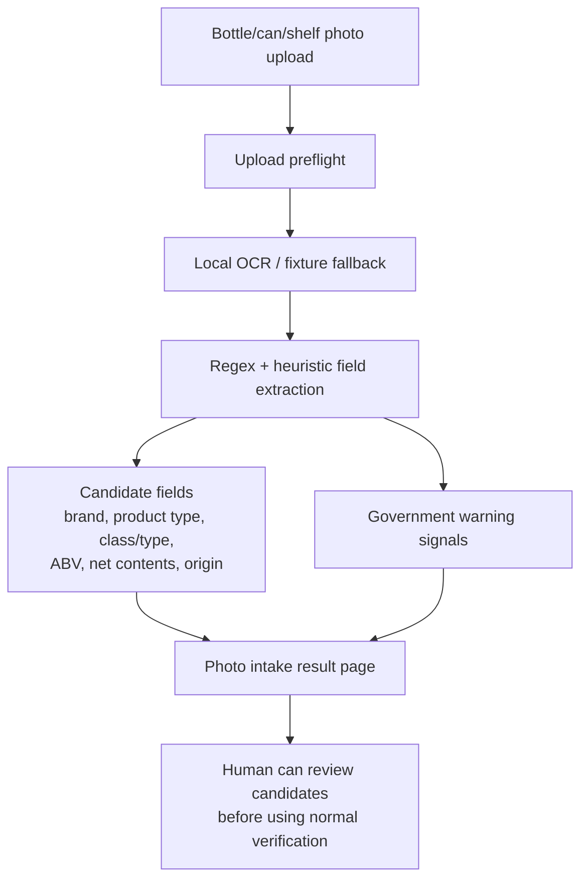

This branch does not produce a COLA verification verdict. It proves the OCR and
field-extraction layer can work on real photos, then keeps formal verification
dependent on application fields or a manifest.

### Public COLA Example Comparison Contract

The COLA Cloud-derived public example demo is closer to the real agency
workflow: it has public application fields plus associated label panels.

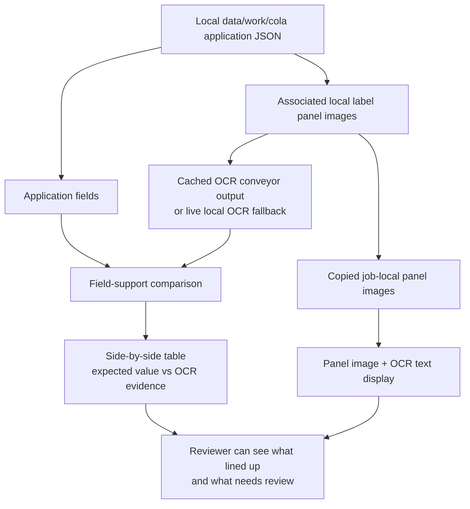

This route does not call COLA Cloud at runtime. It reads already-downloaded
local files and is mainly for demonstration/evaluation storytelling.

### Multi-Panel Application Contract

One COLA application can include multiple label-artwork panels:

```text
front label
back label
neck label
keg collar
government warning panel
other affixed materials
```

For field matching, the application is the unit of analysis. All valid label
images associated with one application must be OCR'd and pooled before deciding
whether the label artwork supports an application field.

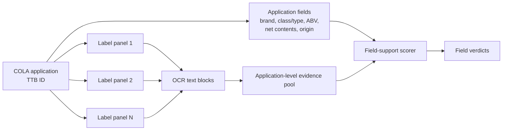

---

## 4. Official Evaluation Corpus

The evaluation corpus should be built from accepted public COLA records because
they provide a safe public proxy for the form-data-to-label-artwork matching
task.

The current evaluation design is a locked application-level split:

```text
2,000 train applications
1,000 validation applications
3,000 locked holdout applications
```

The split must happen at the COLA application level before field-pair examples
are generated. This prevents leakage where the same TTB ID, brand, producer, or
OCR text appears in both training and test examples.

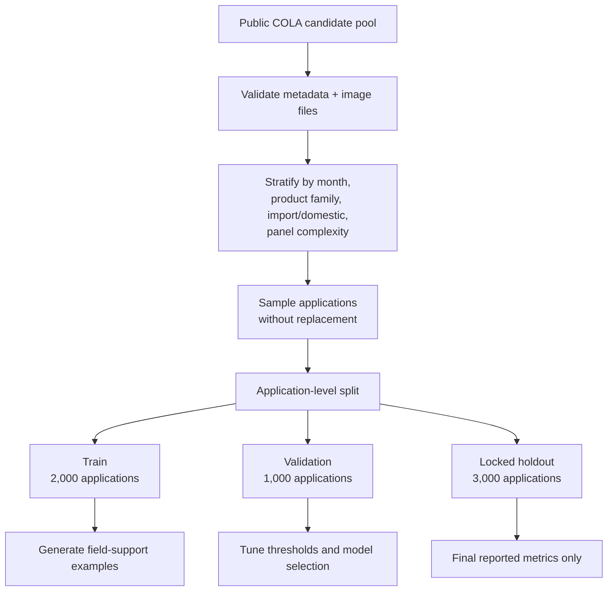

The validation set is used for:

- threshold selection,
- model-family selection,
- safety policy tuning,
- preprocessing decisions.

The locked test set is used once after those settings are frozen.

### OCR Conveyor Safety Layer

The max-win experimental path runs three OCR engines before BERT/graph scoring:

```text
docTR + PaddleOCR + OpenOCR
  -> DistilRoBERTa field-support arbiter
  -> graph-aware evidence scorer
  -> deterministic compliance rules
```

That path must run through the armored OCR conveyor before final evidence
attachment. The conveyor preflights image bytes, validates Pillow decode,
creates a resumable image/job manifest, and executes OCR chunks in subprocesses
so a native engine failure cannot kill the entire run.

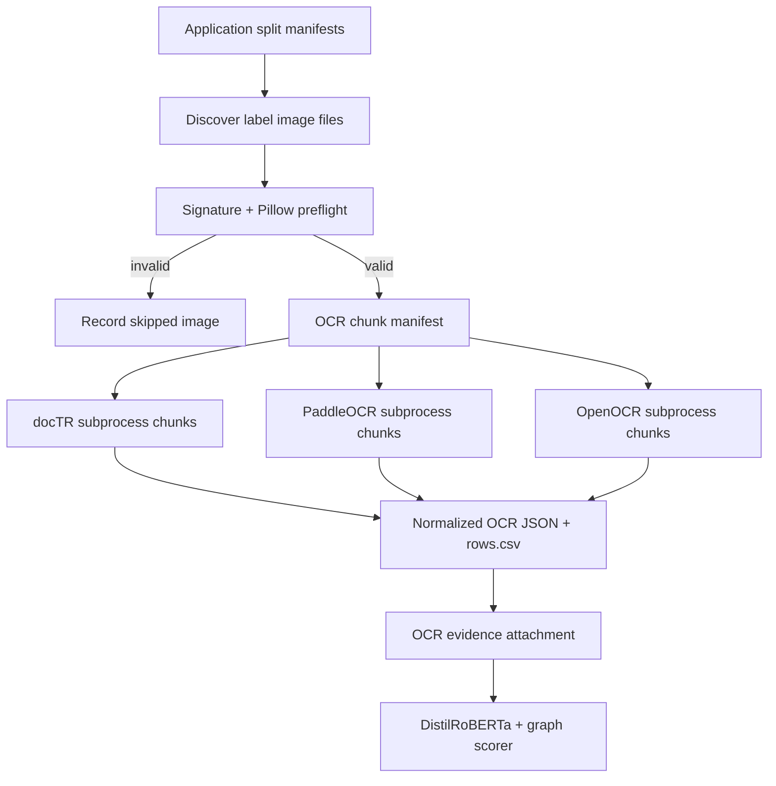

The conveyor is implemented in `scripts/run_ocr_conveyor.py` and documented in
`docs/ocr-conveyor.md`. Outputs remain under gitignored `data/work/`.

After final test reporting, a production model may be retrained on train plus
validation, or eventually on all approved labeled internal data, but the
reported performance estimate must remain tied to the untouched locked test.

---

## 5. OCR Layer

The OCR layer reads image pixels and emits normalized evidence:

```text
text
bounding boxes / polygons where available
confidence where available
source engine
timing
```

Current and tested OCR paths:

| OCR Path | Status | Decision |
|---|---|---|
| docTR | Deployed baseline | Keep stable runtime path |
| PaddleOCR | 30-image smoke: higher F1, higher false-clear rate | Still in contention, needs larger calibration |
| OpenOCR / SVTRv2 | 30-image smoke: fastest complete OCR candidate | Still in contention, needs larger calibration |
| PARSeq / ASTER / ABINet over crops | Fast recognizer-stage experiments | Pruned from runtime promotion in current crop contract |
| FCENet + ASTER | Arbitrary-shape detector experiment | Pruned for CPU latency and low F1 in smoke |

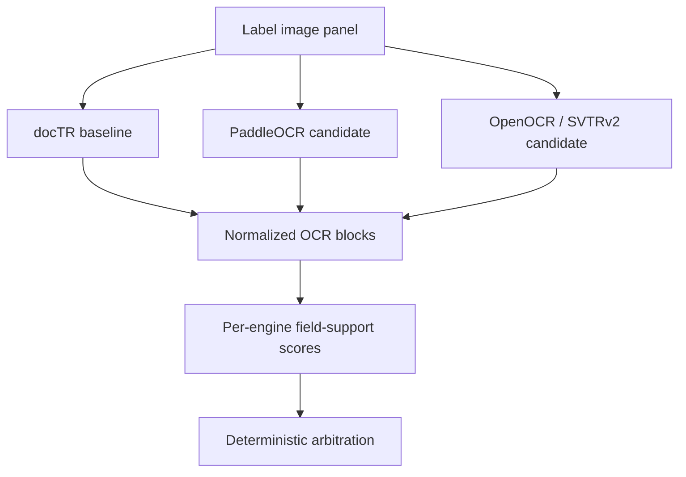

The Monday runtime should not switch OCR engines just because a smoke test looks
interesting. An OCR candidate must win on a larger calibration set and preserve
the false-clear posture before promotion.

---

## 6. Field-Support Scoring

Field-support scoring asks a narrow question:

```text
Does OCR evidence support this expected application field?
```

Target fields:

| Field | Why It Matters |
|---|---|
| Brand name | Common agent matching task |
| Fanciful name | Common label/application text field |
| Class/type | Required designation, currently difficult |
| Alcohol content | High-value numeric field |
| Net contents | Required label element |
| Country of origin | Required for imports |
| Applicant/producer/bottler | Useful but visibility is inconsistent |

The current deterministic scorer uses normalization, RapidFuzz matching, and
source-backed rules. It is intentionally asymmetric:

```text
strong support     -> field supported
weak/missing OCR   -> Needs Review
clear contradiction -> Fail or Fail Candidate
```

---

## 7. Government-Safe Ensemble Policy

The current best pure OCR ensemble treats docTR, PaddleOCR, and OpenOCR as noisy
sensors. It combines their field-support scores with extra caution on high-risk
fields.

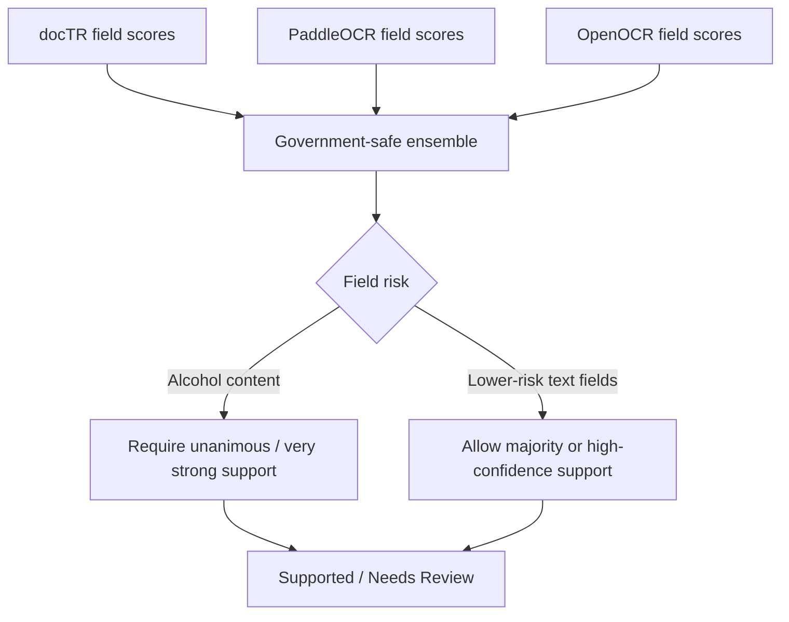

Measured smoke result:

| Policy | F1 | False-Clear Rate | Decision |
|---|---:|---:|---|
| Naive any-engine support | 0.7459 | 0.0357 | Pruned as unsafe |
| Government-safe OCR ensemble | 0.7416 | 0.0000 | Best pure OCR smoke result |

The small F1 sacrifice is acceptable because it removes false clears in the
first shuffled-negative smoke.

---

## 8. Typography Preflight For Warning Boldness

Jenny Park's interview note creates a separate visual problem from OCR: the
government warning heading must be exactly `GOVERNMENT WARNING:` and must be
bold. OCR can tell us what the text says. It does not reliably prove font
weight on noisy raster label images.

The current deployed compliance posture is conservative but no longer blind to
boldness evidence:

```text
GOV_WARNING_EXACT_TEXT       -> deterministic text check
GOV_WARNING_HEADER_CAPS      -> deterministic capitalization check
GOV_WARNING_HEADER_BOLD_REVIEW -> real-adapted typography preflight, then review if uncertain
```

The runtime architecture adds a lightweight OpenCV typography preflight. Early
synthetic-only SVM/XGBoost/CatBoost/ensemble models were intentionally held out
of production because they did not transfer cleanly to real approved COLA
heading crops. The deployed preflight is a narrower real-adapted logistic model:
approved COLA heading crops supply real positive examples, while synthetic
non-bold/degraded crops preserve false-clear testing.

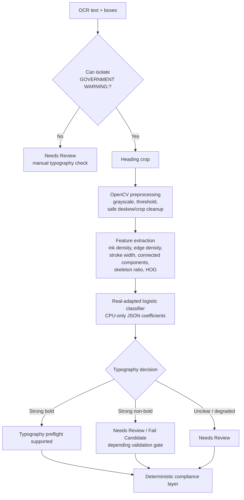

Why this model family fits:

- The task is narrow: classify the visual stroke weight of one known phrase.
- The feature vector can capture the relevant geometry directly.
- CPU inference should be near-zero relative to OCR.
- A synthetic dataset can be generated without touching public-data OCR jobs.
- The decision threshold can be tuned for the primary safety metric:
  false clears.

The first dataset is synthetic because the negative cases are not public. It
renders `GOVERNMENT WARNING:` across many local fonts and distortions.

Manual inspection found that the first binary SVM dataset mixed source font
weight, visual quality, and auto-clearance policy into one target. That was too
noisy: a degraded crop could be generated from a bold font but labeled negative,
and readable medium/semibold crops could be treated as review even though the
requirement is explicit bold type.

The corrected `audit-v5` dataset separates provenance from decision targets and
removes the earlier source `borderline` class. A generated bold font is bold. A
generated non-bold font is not bold. Medium, semibold, demibold, light, thin,
book, and regular font faces are non-bold for this regulatory target. The third
model-facing class is reserved for visually unreadable/degraded crops.

| Label | Meaning |
|---|---|
| `font_weight_label` | Source font provenance: `bold`, `not_bold`. |
| `header_text_label` | Source text provenance: `correct`, `incorrect`. |
| `quality_label` | Crop quality provenance: `clean`, `mild`, `degraded`. |
| `visual_font_decision_label` | Model 1 target: `clearly_bold`, `clearly_not_bold`, `needs_review_unclear`. |
| `header_decision_label` | Model 2 target: `correct`, `incorrect`, `needs_review_unclear`. |

Blurry, broken, faded, cropped, or otherwise unreadable crops are intentionally
routed to `needs_review_unclear`. That third class means the image needs a
human reviewer; it is not a font-weight compromise bucket.

Implemented split:

```text
train:      20,000 crops
validation: 5,000 crops
test:       5,000 crops
```

The split should hold out font families and distortion recipes, not just random
rows. That makes the test stronger: it asks whether the classifier learned
boldness features rather than memorizing one font's rasterization.

Evaluation metrics:

| Metric | Meaning |
|---|---|
| Accuracy / F1 | General binary classifier quality |
| Specificity | Ability to reject non-bold/degraded headings |
| False-clear rate | Non-bold or uncertain headings incorrectly accepted as bold |
| Mean/p95 latency | Whether the crop classifier is negligible compared with OCR |

The planned classifier is justified as a classical statistical-learning model,
not a deep-learning shortcut. Hastie, Tibshirani, and Friedman describe
support vector machines as margin-based supervised learners; this is a good fit
when engineered stroke/shape features carry the decision boundary and compute
cost matters.

Initial measured result from the flawed binary baseline:

| Operating Point | Test F1 | Precision | Recall | False-Clear Rate | Interpretation |
|---|---:|---:|---:|---:|---|
| Zero validation false-clear tolerance | 0.0321 | 0.9737 | 0.0163 | 0.0004 | Safe but barely clears bold headings. |
| 0.25% validation false-clear tolerance | 0.1170 | 0.8987 | 0.0626 | 0.0059 | Still too weak for promotion. |
| 5% validation false-clear tolerance | 0.7757 | 0.8867 | 0.6894 | 0.0733 | Better F1, unsafe false-clear posture. |

Latency:

```text
mean SVM decision latency: about 0.09 ms/crop
```

Conclusion:

```text
The model class is computationally viable, but the first synthetic target was
too noisy to promote. It supports a measured path toward typography preflight
while confirming that boldness should remain Needs Review for the submission.
```

Corrected multiclass comparison:

```text
output: data/work/typography-preflight/model-comparison-v1/
train:  6,000 synthetic crops
val:    1,500 synthetic crops
test:   1,500 synthetic crops
```

| Task | Model | Accuracy | Macro F1 | False-Clear Rate | Batch ms/crop | Single-row ms |
|---|---|---:|---:|---:|---:|---:|
| Visual font decision | SVM | 0.9400 | 0.9396 | 0.0360 | 0.0048 | 0.0795 |
| Visual font decision | XGBoost | 0.9567 | 0.9567 | 0.0551 | 0.0032 | 0.1151 |
| Visual font decision | CatBoost | 0.9480 | 0.9479 | 0.0711 | 0.0054 | 1.9588 |
| Header text decision | SVM | 0.8420 | 0.8393 | 0.1101 | 0.0055 | 0.0801 |
| Header text decision | XGBoost | 0.8560 | 0.8546 | 0.1612 | 0.0033 | 0.1693 |
| Header text decision | CatBoost | 0.8447 | 0.8430 | 0.1702 | 0.0059 | 1.9376 |

Architectural interpretation:

- XGBoost gives the strongest raw F1 and accuracy on engineered OpenCV
  features.
- SVM gives the safest false-clear behavior and near-zero CPU decision latency.
- CatBoost is viable, but it is slower in this numeric-feature setup and does
  not currently improve the safety metric.
- The current models use hard argmax. The next architecture step is a
  validation-tuned reject option that sends weak `bold` or `correct`
  predictions to `needs_review_unclear`.

Extended 80/20 comparison:

```text
output: data/work/typography-preflight/model-comparison-extended-80-20-v1/
train:  8,000 synthetic crops
test:   2,000 synthetic crops
```

| Task | Model | Accuracy | Macro F1 | False-Clear Rate | Single-row ms |
|---|---|---:|---:|---:|---:|
| Visual font decision | SVM | 0.9390 | 0.9385 | 0.0218 | 0.0780 |
| Visual font decision | XGBoost | 0.9720 | 0.9720 | 0.0293 | 0.1120 |
| Visual font decision | LightGBM | 0.9760 | 0.9760 | 0.0263 | 1.9275 |
| Visual font decision | Logistic Regression | 0.9655 | 0.9656 | 0.0195 | 0.0780 |
| Visual font decision | MLP | 0.9650 | 0.9650 | 0.0203 | 0.1463 |
| Visual font decision | Strict-veto ensemble | 0.9115 | 0.9131 | 0.0038 | 2.6810 |
| Header text decision | SVM | 0.8560 | 0.8539 | 0.0766 | 0.0792 |
| Header text decision | XGBoost | 0.8845 | 0.8832 | 0.1404 | 0.1144 |
| Header text decision | LightGBM | 0.8915 | 0.8911 | 0.1149 | 1.8772 |
| Header text decision | Logistic Regression | 0.8815 | 0.8811 | 0.1231 | 0.0789 |
| Header text decision | MLP | 0.8840 | 0.8841 | 0.0803 | 0.1466 |
| Header text decision | Strict-veto ensemble | 0.7505 | 0.7510 | 0.0360 | 2.7161 |

Strict-veto ensemble:

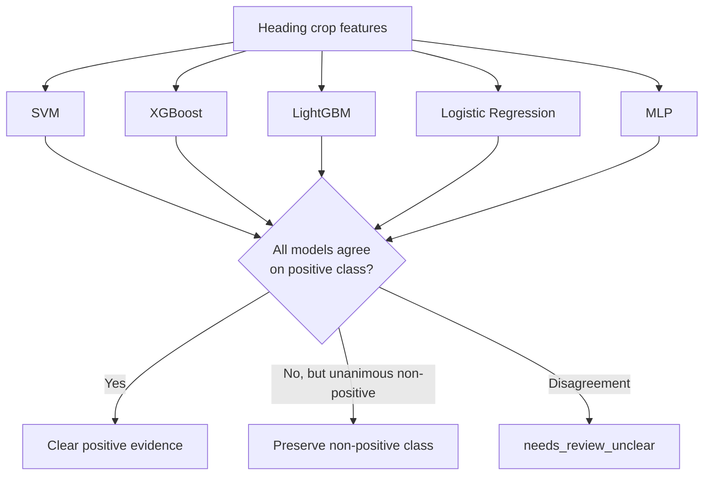

The ensemble's value is not maximum F1. Its value is a conservative reviewer
queue: fewer false clears, more manual review. That is a better fit for a
government preflight tool than an aggressive single-model argmax.

Large geometry-stress ensemble run:

```text
output:      data/work/typography-preflight/model-comparison-large-geometry-v1/
base train: 32,000 crops
calibrate:  8,000 crops
test:       10,000 crops
geometry:   50% normal, 50% rotated/bent
```

| Task | Policy | Test F1 | False-Clear Rate | P95 ms |
|---|---|---:|---:|---:|
| Visual font decision | Strict-veto ensemble | 0.9440 | 0.0024 | 2.4952 |
| Visual font decision | Calibrated logistic stacker | 0.9862 | 0.0087 | 2.5141 |
| Visual font decision | LightGBM reject threshold | 0.9867 | 0.0083 | 3.0201 |
| Visual font decision | XGBoost reject threshold | 0.9876 | 0.0086 | 2.8528 |
| Visual font decision | CatBoost stacker | 0.9878 | 0.0080 | 3.0394 |
| Header text decision | Strict-veto ensemble | 0.7794 | 0.0462 | 2.4831 |
| Header text decision | Calibrated logistic stacker | 0.9007 | 0.0819 | 2.7285 |
| Header text decision | LightGBM reject threshold | 0.7226 | 0.0164 | 2.8409 |
| Header text decision | XGBoost reject threshold | 0.6131 | 0.0027 | 3.0246 |
| Header text decision | CatBoost stacker | 0.9020 | 0.0857 | 3.8643 |

The architecture decision is now sharper:

- Visual boldness can support a future reviewer-assist preflight. Strict-veto is
  safest; CatBoost is the raw-F1 winner.
- Header text correctness remains review-first unless a reject-threshold policy
  is acceptable, because the high-F1 stackers still false-clear too often.
- All stacker latency numbers are end-to-end: base models plus stacker/reject
  policy from raw engineered crop features.

Reference:

```text
Hastie, Trevor; Tibshirani, Robert; Friedman, Jerome.
The Elements of Statistical Learning: Data Mining, Inference, and Prediction.
2nd ed., Springer, 2009.
```

Original promotion gate:

```text
The typography preflight can become runtime evidence only if validation/test
false-clear behavior is safe. The first synthetic-only models failed this gate;
the real-adapted logistic model below is the first runtime promotion.
```

Real approved COLA smoke:

```text
output: data/work/typography-preflight/real-cola-smoke-v1/
sample: 100 approved applications / 203 label images
heading crops: 124 crops across 68 applications
crop source: cached docTR + PaddleOCR + OpenOCR output
```

| Classifier | Model | App clear rate | Crop review rate | P95 ms/crop |
|---|---|---:|---:|---:|
| Boldness | Strict-veto ensemble | 0.01 | 0.9919 | 13.93 |
| Boldness | CatBoost stacker | 0.08 | 0.8871 | 3.83 |
| Warning text | Strict-veto ensemble | 0.00 | 1.0000 | 3.70 |
| Warning text | CatBoost stacker | 0.03 | 0.9435 | 5.23 |

This real-positive smoke test says the classifier stage is fast enough, but the
synthetic typography training distribution does not transfer cleanly enough to
real approved COLA warning crops. It also shows that heading crop isolation is
part of the problem: PaddleOCR and OpenOCR found nearly all current crops, while
docTR found very few with the first block-matching method.

Runtime correction:

```text
cropper: experiments/typography_preflight/real_cola_smoke.py
runtime crop service: app/services/typography/warning_heading.py
runtime model: app/models/typography/boldness_logistic_v1.json
runtime classifier: app/services/typography/boldness.py

corrected cropper:
  trims OCR lines to the GOVERNMENT WARNING: prefix
  groups split docTR word boxes such as GOVERNMENT + WARNING:
  normalizes crops toward black text on white

training/evaluation:
  real positive train crops: 3,083 approved COLA warning headings
  real positive holdout crops: 768 approved COLA warning headings
  synthetic negatives/review examples: non-bold and degraded headings
  model family: Logistic Regression over OpenCV/HOG features
  exported dependency profile: JSON coefficients, numpy, OpenCV

selected threshold:
  threshold: 0.9545819397993311
  validation false-clear rate: 0.000624
  synthetic holdout false-clear rate: 0.001800
  synthetic holdout F1: 0.865570
  approved COLA holdout clear rate: 0.921875
```

Runtime decision:

```text
probability >= 0.9546 -> pass GOV_WARNING_HEADER_BOLD_REVIEW
probability <  0.9546 -> Needs Review
no crop / unreadable crop -> Needs Review
```

This solves the MVP requirement without overstating certainty: strong real-COLA
bold evidence can now clear, while weak evidence still goes to a reviewer.

CNN challenger:

```text
code:
  experiments/typography_preflight/train_audit_v6_cnn.py
  experiments/typography_preflight/evaluate_audit_v6_cnn_thresholds.py

dataset:
  audit-v6, 9,000 crops
  train / validation / test = 6,000 / 1,500 / 1,500

model:
  MobileNetV3-Small
  ImageNet transfer learning
  4 classes: bold, not_bold, unreadable_review, not_applicable

test hard-argmax:
  accuracy: 0.9560
  macro F1: 0.9686
  false-clear rate: 0.005507

thresholded clearance:
  zero validation false-clear threshold:
    binary policy macro F1 0.7755
    test false-clear 0.000000
    true-bold clear rate 0.5220
  0.005 validation false-clear tolerance:
    binary policy macro F1 0.8864
    test false-clear 0.002203
    true-bold clear rate 0.7432

latency:
  CPU batch: 2.98 ms/crop
  CPU single-crop p95: 5.21 ms/crop
```

Decision: the CNN is a strong offline challenger, but it is not automatically
promoted. Runtime promotion requires a same-split comparison against the current
real-adapted logistic bridge and a threshold that preserves the government-safe
false-clear posture. If promoted later, it should be pass evidence only; all
non-clear cases still route to `Needs Review`.

Audit-v6 baseline retrain:

```text
code:
  experiments/typography_preflight/compare_audit_v6_baselines.py

output:
  data/work/typography-preflight/model-comparison-audit-v6-defensible-v2/

methodology:
  base models fit on stratified 80% subset of audit-v6 train
  stackers fit on stratified 20% meta subset of audit-v6 train
  reject thresholds tune on audit-v6 validation
  final metrics score once on audit-v6 test
  test is never used for fitting, threshold selection, or model selection

target:
  boldness_label

base models:
  SVM, XGBoost, LightGBM, Logistic Regression, MLP, CatBoost

ensembles:
  strict veto
  calibrated logistic stacker
  LightGBM reject-threshold stacker
  XGBoost reject-threshold stacker
  CatBoost stacker
```

| Audit-v6 model / policy | Test macro F1 | Test false-clear | p95 ms/crop |
|---|---:|---:|---:|
| SVM | 0.9377 | 0.0385 | 0.11 |
| XGBoost | 0.9613 | 0.0341 | 0.18 |
| LightGBM | 0.9703 | 0.0242 | 2.23 |
| Logistic Regression | 0.9529 | 0.0297 | 0.13 |
| MLP | 0.9398 | 0.0518 | 0.29 |
| CatBoost | 0.9471 | 0.0407 | 2.04 |
| Strict-veto ensemble | 0.8679 | 0.0110 | 10.94 |
| Calibrated logistic stacker | 0.9696 | 0.0198 | 11.38 |
| XGBoost reject-threshold stacker | 0.9208 | 0.0033 | 12.72 |
| CNN threshold, zero validation false-clear | 0.7755* | 0.0000 | 5.21 |
| CNN threshold, 0.005 validation tolerance | 0.8864* | 0.0022 | 5.21 |

`*` CNN threshold rows report binary clear/not-clear policy macro F1. They are
not four-class argmax macro F1 because thresholding converts the CNN into a
narrow pass-evidence policy.

Architectural implication: the classical baselines are useful sanity checks and
latency references, but their audit-v6 false-clear rates are still too high for
automatic government-warning boldness clearance. Reject-threshold ensembles
improve safety but lose too much useful clearance. The CNN remains the stronger
future challenger; the deployed logistic JSON bridge remains the simpler MVP
runtime model until a same-split promotion gate is completed.

CNN-inclusive ensemble promotion test:

```text
code:
  experiments/typography_preflight/compare_audit_v6_cnn_ensemble.py

output:
  data/work/typography-preflight/model-comparison-audit-v6-cnn-ensemble-v1/

methodology:
  all models use audit-v6
  train / validation / test = 6,000 / 1,500 / 1,500
  classical base learners use 5-fold out-of-fold train probabilities
  CNN base learner uses 5 MobileNetV3 fold models for out-of-fold train probabilities
  final base models score validation/test
  stackers train on out-of-fold train probabilities from all bases, including CNN
  reject thresholds tune on validation
  final metrics score once on test

base learners:
  SVM, XGBoost, LightGBM, Logistic Regression, MLP, CatBoost,
  MobileNetV3 CNN
```

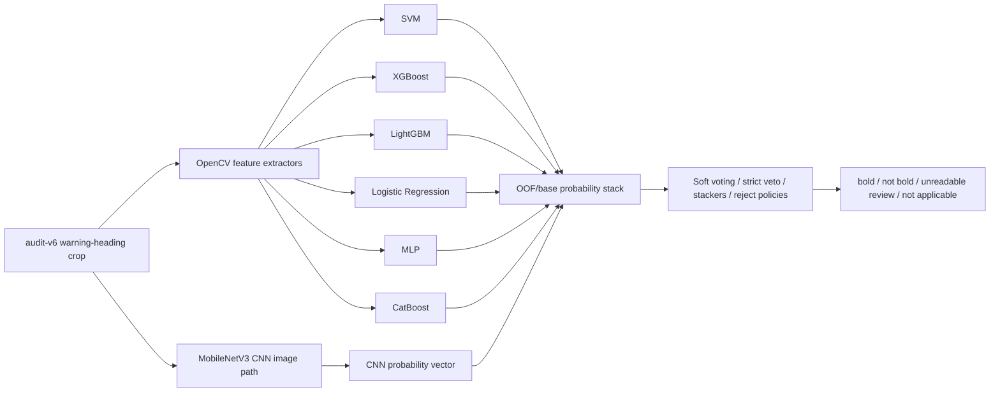

| Audit-v6 CNN-inclusive model / policy | Train F1 | Train false-clear | Test macro F1 | Test false-clear |
|---|---:|---:|---:|---:|
| SVM base | 0.9453 | 0.0346 | 0.9467 | 0.0363 |
| XGBoost base | 0.9705 | 0.0302 | 0.9633 | 0.0297 |
| LightGBM base | 0.9737 | 0.0252 | 0.9753 | 0.0198 |
| Logistic Regression base | 0.9614 | 0.0274 | 0.9546 | 0.0242 |
| MLP base | 0.9656 | 0.0288 | 0.9656 | 0.0275 |
| CatBoost base | 0.9505 | 0.0476 | 0.9472 | 0.0452 |
| MobileNetV3 CNN base | 0.9523 | 0.0022 | 0.9686 | 0.0055 |
| Soft voting, all bases + CNN | 0.9784 | 0.0160 | 0.9742 | 0.0198 |
| Strict veto, all bases + CNN | 0.8400 | 0.0006 | 0.8530 | 0.0022 |
| Logistic stacker, all bases + CNN | 0.9932 | 0.0064 | 0.9908 | 0.0099 |
| LightGBM stacker, all bases + CNN | 1.0000 | 0.0000 | 0.9900 | 0.0143 |
| XGBoost stacker, all bases + CNN | 0.9985 | 0.0025 | 0.9874 | 0.0165 |
| CatBoost stacker, all bases + CNN | 0.9933 | 0.0072 | 0.9895 | 0.0154 |
| LightGBM reject, all bases + CNN | 0.9683 | 0.0000 | 0.9552 | 0.0033 |
| XGBoost reject, all bases + CNN | 0.9784 | 0.0000 | 0.9656 | 0.0044 |

Decision update: the CNN-inclusive ensemble test replaces the earlier
CNN-as-separate-challenger interpretation. The CNN is now proven as an ensemble
base input. The best next candidate is a reject-threshold ensemble with CNN
included, but the MVP runtime should still keep the simpler real-adapted JSON
logistic preflight until a full app-level promotion test is frozen.

---

## 9. Domain-NER / BERT Arbiter Experiments

Post-OCR Transformer models are being tested as arbiters, not as OCR engines and
not as compliance decision makers.

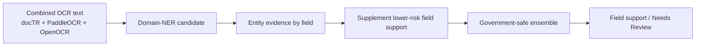

Measured smoke results:

| Candidate | Entity-Only F1 | Hybrid F1 | False-Clear Rate | Decision |
|---|---:|---:|---:|---|
| WineBERT/o labels | 0.4865 | 0.7416 | 0.0000 | Not promoted; no lift, unknown license, wine-only coverage |
| WineBERT/o NER | 0.1176 | 0.7416 | 0.0000 | Not promoted |
| OSA market-domain NER | 0.5166 | 0.7486 | 0.0000 | Promising; needs 100-app calibration |
| FoodBaseBERT-NER | 0.0522 | 0.7416 | 0.0000 | Pruned; wrong semantic domain |

OSA is the current best BERT-assisted smoke result, but its lift was one extra
true positive across `224` field-support examples. That earns a larger
calibration run, not automatic deployment.

---

## 10. Trainable Field-Support Classifier

The next serious supervised model should be a field-support classifier, not a
token-level NER model.

Why:

- public COLA data gives application fields and accepted label images,
- it does not give gold token-level spans,
- field-support classification directly matches the product problem,
- it is easier to weak-label without pretending we have human span labels.

Training example shape:

```text
Input:
  field_name
  expected application value
  OCR candidate text or OCR evidence window
  optional engine scores/confidence/source

Output:
  supports_field = yes/no
```

Example positive:

```text
FIELD: alcohol_content
EXPECTED: 45% Alc./Vol. (90 Proof)
OCR TEXT: OLD TOM DISTILLERY ... 45% Alc./Vol. ... 750 mL
LABEL: supports
```

Example negative:

```text
FIELD: alcohol_content
EXPECTED: 13.5% Alc./Vol.
OCR TEXT: OLD TOM DISTILLERY ... 45% Alc./Vol. ... 750 mL
LABEL: does_not_support
```

Recommended training order:

```text
1. DistilRoBERTa field-support classifier
2. RoBERTa-base field-support classifier
3. DistilRoBERTa / RoBERTa + government-safe ensemble
```

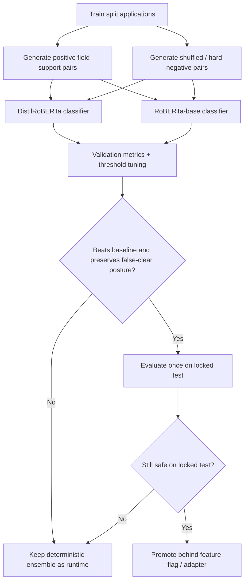

The classifier is allowed to improve recall only if it does not create an
unacceptable false-clear rate. For this project, the false-clear metric is more
important than headline F1.

---

## 11. Metrics And Gates

Primary safety metric:

| Metric | Meaning |
|---|---|
| False-clear rate | Known bad or shuffled-negative examples incorrectly treated as supported/pass |

Secondary metrics:

| Metric | Meaning |
|---|---|
| Field-support F1 | Balance of support precision and recall |
| Recall | How often true field evidence is found |
| Precision | How often supported fields are actually supported |
| Reviewer-escalation rate | How much uncertainty routes to Needs Review |
| Application-level pass/review/fail distribution | How the full triage behaves |
| Per-application latency | Whether it stays near stakeholder tolerance |

Promotion gate:

```text
candidate model can be promoted only if:
  validation F1 improves over baseline
  validation false-clear rate is acceptable
  locked-test false-clear rate remains acceptable after freeze
  CPU latency fits the deployment target
  runtime has a rollback path
```

---

## 12. Final Runtime Recommendation

For the take-home submission, the safest runtime posture is:

```text
Deployed app:
  docTR or fixture OCR
  deterministic field matching
  source-backed rules
  conservative Needs Review fallback

Experimental evidence:
  PaddleOCR/OpenOCR/ensemble/BERT results documented
  OSA and field-support classifier path ready for calibration
```

Do not merge a trained RoBERTa or DistilRoBERTa model into the public runtime
unless it clears the validation and locked-test gates. A measured, conservative
system is stronger than an impressive model that overfits or false-clears
problematic labels.

---

## 13. Future Architecture

If time and data permit after the current sprint:

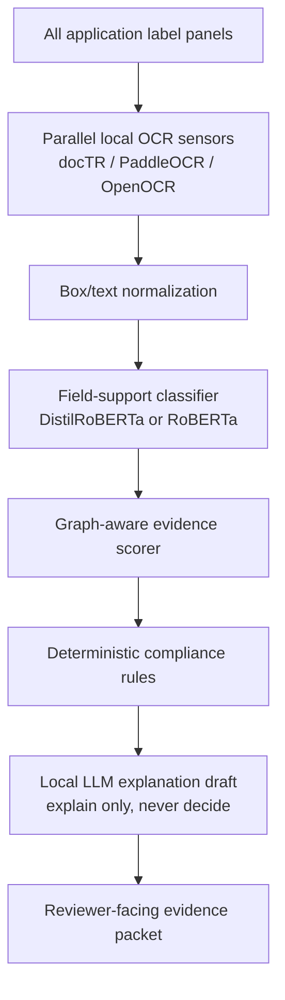

A custom HO-GNN/TPS/SVTR curved-text vision model remains a future research
path. It should only be pursued if mature OCR engines and post-OCR arbitration
plateau because OCR fails to detect text in the first place.
