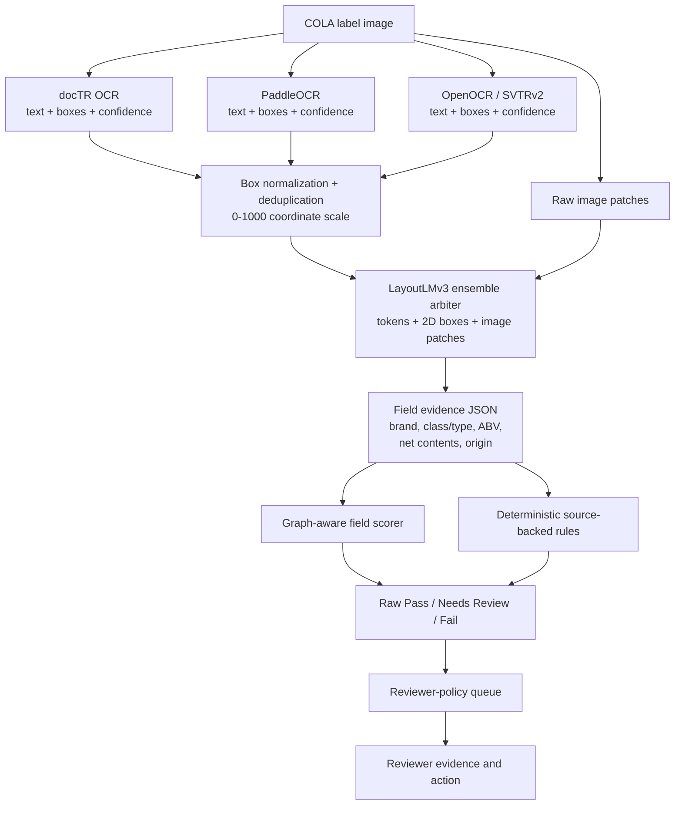
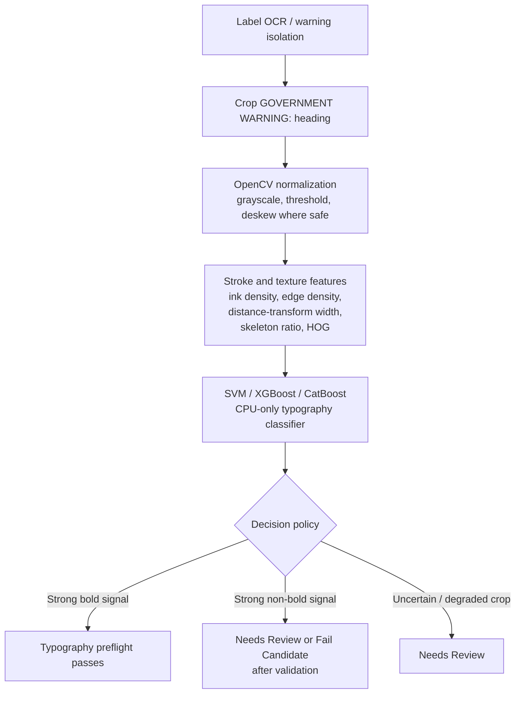

# TRADEOFFS.md — Labels On Tap

**Project:** Labels On Tap
**Canonical deployment URL:** `https://www.labelsontap.ai`
**Repository:** `https://github.com/AaronNHorvitz/Labels-On-Tap`
**Document purpose:** Explain the major product, architecture, data, security, and regulatory trade-offs made to deliver a working prototype within the take-home deadline.

---

## 1. Executive Summary

Labels On Tap is a **local-first, source-backed alcohol label preflight prototype** for TTB-style Certificate of Label Approval (COLA) review.

The prototype is intentionally scoped around the highest-value reviewer workflow:

```text
Upload label artwork + expected application fields
  → run local OCR / fixture OCR fallback
  → compare label text to application data
  → apply deterministic source-backed rules
  → return Pass / Needs Review / Fail
  → route through reviewer-policy queues where configured
  → show evidence and reviewer action
```

The core trade-off is deliberate:

> We prioritized a working, deployed, auditable reviewer-support application over attempting to implement every possible federal beverage-alcohol rule before the deadline.

The repository includes a large legal/research corpus and source-backed rule matrix to demonstrate how the rule system can scale. The runtime MVP implements a focused subset of rules that are valuable, demoable, and feasible within the sprint.

**OCR smoke-test synthesis:** The 30-image OCR smoke test carries inherent statistical variance, but it achieved its primary engineering objective: rapid architectural pruning. It identified the strongest near-term production candidates as complete OCR engines, especially docTR, PaddleOCR, and OpenOCR/SVTRv2, while showing that crop-dependent recognizers such as PARSeq, ASTER, and ABINet did not improve field-support performance under the tested OpenOCR-box crop contract. It also showed that FCENet + ASTER, while useful as an arbitrary-shape text detection research checkpoint, missed the CPU latency target for this compliance workflow. By isolating these failure modes early, the project narrowed the production path without spending the remaining sprint on full-scale calibration of architectures that did not earn promotion in the smoke test.

**Typography-preflight synthesis:** The first synthetic-only boldness models
were correctly rejected because they did not transfer to real approved COLA
warning crops. The fix was not more model complexity; it was better evidence.
The app now isolates the actual `GOVERNMENT WARNING:` heading, trims away body
text, groups split docTR word boxes, and runs a real-adapted logistic model
exported as JSON coefficients. At the selected validation threshold (`0.9546`),
the model measured validation false-clear `0.000624`, synthetic holdout
false-clear `0.001800`, and approved-COLA real-positive holdout clear rate
`0.921875`. Confident bold evidence can pass; anything uncertain remains
`Needs Review`.

**Model architecture synthesis:** The next trainable-model path should be a
field-support classifier, not token-level NER. Public COLA data provides
application fields and accepted label images, but not human token-span labels.
The current preferred split for trained DistilRoBERTa/RoBERTa experiments is
application-level `60%` train / `20%` validation / `20%` locked test, with the
test set untouched until model choice, preprocessing, and thresholds are frozen.
See [MODEL_ARCHITECTURE.md](MODEL_ARCHITECTURE.md) for the end-to-end diagrams.

---

## 2. Product Scope Trade-Offs

### 2.1 Preflight Support, Not Final Agency Action

**Decision:** Labels On Tap returns **Pass**, **Needs Review**, or **Fail Candidate / Fail** style results. It does not claim to approve, reject, or legally certify a COLA application.

**Why:** Many TTB label issues are deterministic, such as exact government-warning text or prohibited abbreviations. Others require human/legal context, such as health claims, misleading geographic impressions, formula/SOC issues, or image-quality ambiguity.

**Implication:** The tool is framed as reviewer support and pre-submission/pre-review triage, not a replacement for TTB specialists or legal counsel.

---

### 2.2 Reviewer Policy Gates Before Acceptance Or Rejection

**Decision:** Raw machine verdicts should remain separate from final workflow
actions. The planned policy layer has three independent control-board settings:

```text
Send unknown government-warning cases to human review: Yes / No
Require reviewer approval before rejection: Yes / No
Require reviewer approval before acceptance: Yes / No
```

Default posture:

```text
Unknown government warning human review: No
Before rejection: No
Before acceptance: No
```

**Why:** This fits the stakeholder reality better than a single automatic
approve/reject pipeline. Sarah needs batch triage for 200-300 application
surges, Dave needs the ability to apply judgment, and Jenny's strict warning
requirements still need a safe path when OCR or image quality is uncertain.

**Implication:** A `Fail` result can be routed directly to `Ready to reject` or
to `Rejection review`. A `Pass` result can be either `Ready to accept` or
`Acceptance review`, depending on the pilot's policy posture. Unknown
government-warning evidence is stricter: because the warning is mandatory, it
defaults to failure when the warning-review gate is off. `Needs Review` always
remains a manual evidence-review queue.

| Raw system result | Warning unknown review enabled | Rejection review required | Acceptance review required | Policy queue |
|---|---:|---:|---:|---|
| Pass | n/a | n/a | No | Ready to accept |
| Pass | n/a | n/a | Yes | Acceptance review |
| Fail | n/a | No | n/a | Ready to reject |
| Fail | n/a | Yes | n/a | Rejection review |
| Government warning unknown | No | No | n/a | Ready to reject |
| Government warning unknown | No | Yes | n/a | Rejection review |
| Government warning unknown | Yes | any | n/a | Manual evidence review |
| Needs Review | n/a | any | any | Manual evidence review |

This choice preserves the efficiency win while avoiding overclaiming automated
adverse action. It also gives the agency a knob to tighten or loosen review
requirements without changing OCR, model, or compliance-rule code.

---

### 2.3 Focused Active Rule Set

**Decision:** The MVP prioritizes a focused set of active rules:

```text
- Brand name fuzzy matching
- Country of origin check for imports
- Government warning exact text
- Government warning heading capitalization
- Government warning boldness preflighted from an isolated heading crop; uncertain crops still route to Needs Review
- ABV / A.B.V. prohibited alcohol-content wording
- Malt beverage 16 fl. oz. → 1 Pint rule
- OCR low-confidence / image-quality Needs Review
```

**Why:** These rules map directly to common reviewer tasks and stakeholder pain points. They also produce clear demo outcomes: Pass, Fail, and Needs Review.

**What is deferred:** Full wine appellation validation, full formula-to-label reconciliation, complete semi-generic wine-name logic, absinthe/thujone support validation, health-claim legal analysis, geospatial AVA analysis, and full typography measurement.

**Implication:** The legal corpus captures many more criteria than the MVP actively enforces. Those criteria are documented as future rules or Needs Review heuristics.

---

### 2.4 One-Click Demo Before Full Manual Batch Workflow

**Decision:** The MVP includes one-click evaluator demos using deterministic fixtures. Manual upload exists for the single-label workflow. Full manual multi-file batch upload is valuable but can be deferred if time is tight.

**Why:** Evaluators should be able to see the product’s value immediately without hunting for label images or constructing manifests.

**Implication:** The one-click demo proves the rule engine and UX path. Manual batch upload can be added once the core deployed app is stable.

---

### 2.5 Photo Intake As OCR Demonstration, Not Verification

**Decision:** The app includes a demonstration-only photo intake workflow for
real bottle, can, or store-shelf photos.

**Why:** Aaron has a private local set of real alcohol-label phone photos. Those
images are useful for showing raw OCR behavior, glare/angle failure modes, and
candidate field extraction. They are not COLA applications and do not contain
trusted application fields.

**Implication:** Photo intake displays candidate fields and OCR evidence, but it
does not return a COLA verification verdict. Formal Pass / Needs Review / Fail
requires application fields or a manifest so the system can compare expected
values to label evidence.

---

## 3. Architecture Trade-Offs

### 3.1 Local-First OCR Instead of Hosted ML APIs

**Decision:** The app does not call OpenAI, Anthropic, Google Cloud Vision, Azure Vision, AWS Textract, or any hosted OCR/ML service at runtime.

**Why:** The stakeholder notes identify outbound ML endpoints as a serious infrastructure risk. A prior vendor pilot was blocked by Treasury firewall constraints. A local-first architecture is safer and more aligned with the assignment.

**Implication:** OCR and validation run inside the application environment. Runtime behavior does not depend on external inference services.

---

### 3.2 docTR / Local OCR with Fixture OCR Fallback

**Decision:** The architecture uses a local OCR adapter, with docTR as the primary OCR candidate, plus a deterministic fixture OCR fallback for generated demo/test labels.

**Why:** docTR supports local OCR with text geometry and confidence-style outputs. However, OCR can be slower, environment-sensitive, and less deterministic than pure rule tests. The fixture fallback guarantees that one-click demos and tests remain stable.

**Implication:** Demo fixtures can use known OCR text while real uploads still exercise the local OCR path. The UI should clearly indicate whether a result came from fixture ground truth or local OCR.

---

### 3.2.1 Measured OCR Engine Sweep Before Runtime Promotion

**Decision:** Alternate OCR engines such as PaddleOCR and OpenOCR/SVTRv2 should be evaluated as experimental local adapters before they are allowed to replace docTR in the deployed app.

**Why:** The curved-text research strongly suggests that modern pre-trained OCR systems may handle cylindrical, circular, rotated, and irregular label text better than the current baseline. However, the assignment rewards a working, reliable prototype. A promising model should not become the production path until it wins on the same COLA Cloud-derived public calibration data and stays inside the latency budget.

**Candidate order:**

```text
1. docTR baseline
2. PaddleOCR / PP-OCR local adapter
3. OpenOCR / SVTRv2 local adapter
4. PARSeq recognition over detected crops, if recognizer-level accuracy helps
5. ASTER recognition over detected crops, if geometric rectification helps
6. FCENet detection plus ASTER recognition, if arbitrary-shape detection helps
7. ABINet recognition over detected crops, if explicit language-model correction helps
8. Combined OCR evidence, if two engines find complementary text
```

**Promotion gate:**

```text
- local/self-hosted inference only,
- normalized OCR output with text, boxes, confidence, source, and timing,
- better field-match rates on the calibration set,
- no worse false-clear behavior on synthetic known-bad fixtures,
- measured p50/p95/worst-case latency,
- clean dependency and deployment story,
- rollback to docTR if the engine fails or is too slow.
```

**Implication:** The app can pursue better OCR aggressively without destabilizing the deployed demo. Until a candidate wins, docTR remains the safe runtime baseline.

**Current smoke finding:** On the first 20-application / 30-image field-support comparison, PaddleOCR improved F1, accuracy, and recall versus docTR, while docTR preserved the lower false-clear rate. OpenOCR/SVTRv2 was the fastest complete OCR candidate and matched docTR's false-clear rate in the same smoke, but had lower F1. PARSeq, ASTER, and ABINet were tested as recognizers over OpenOCR-detected crops. All were fast on CPU, but none improved field-support F1 in that crop setup. ASTER and ABINet produced zero false clears in the first smoke, but at the cost of low recall. FCENet plus ASTER tested arbitrary-shape detection directly, but CPU latency exceeded the operational target and field-support F1 dropped sharply. Small sample sizes increase variance, so these results are directional calibration evidence only. PaddleOCR remains undecided and promising; it should not be promoted or rejected until a larger calibration run confirms whether the F1 lift survives.

The current comparison is intentionally presented as a statistical smoke table,
not a final production claim. It uses the same `20` public COLA applications,
`30` label images, and `224` field-support examples for each OCR engine.
Accepted public COLA fields are positive examples. Same-field values shuffled
from other applications are controlled negatives. The decision threshold is a
fuzzy field-support score of `90`.

#### OCR Field-Support Metrics

| Model | Accuracy | Precision | Recall | Specificity | F1 | False-clear rate |
|---|---:|---:|---:|---:|---:|---:|
| docTR | 0.7455 | 0.9825 | 0.5000 | 0.9911 | 0.6627 | 0.0089 |
| PaddleOCR | 0.7723 | 0.9552 | 0.5714 | 0.9732 | 0.7151 | 0.0268 |
| OpenOCR / SVTRv2 | 0.7143 | 0.9800 | 0.4375 | 0.9911 | 0.6049 | 0.0089 |
| PARSeq AR over OpenOCR crops | 0.6875 | 0.9773 | 0.3839 | 0.9911 | 0.5513 | 0.0089 |
| PARSeq NAR/refine-2 over OpenOCR crops | 0.6875 | 0.9773 | 0.3839 | 0.9911 | 0.5513 | 0.0089 |
| ASTER over OpenOCR crops | 0.6920 | 1.0000 | 0.3839 | 1.0000 | 0.5548 | 0.0000 |
| FCENet + ASTER | 0.6205 | 0.9655 | 0.2500 | 0.9911 | 0.3972 | 0.0089 |
| ABINet over OpenOCR crops | 0.6607 | 1.0000 | 0.3214 | 1.0000 | 0.4865 | 0.0000 |

#### Confusion Counts

| Model | TP | TN | FP | FN | Examples |
|---|---:|---:|---:|---:|---:|
| docTR | 56 | 111 | 1 | 56 | 224 |
| PaddleOCR | 64 | 109 | 3 | 48 | 224 |
| OpenOCR / SVTRv2 | 49 | 111 | 1 | 63 | 224 |
| PARSeq AR over OpenOCR crops | 43 | 111 | 1 | 69 | 224 |
| PARSeq NAR/refine-2 over OpenOCR crops | 43 | 111 | 1 | 69 | 224 |
| ASTER over OpenOCR crops | 43 | 112 | 0 | 69 | 224 |
| FCENet + ASTER | 28 | 111 | 1 | 84 | 224 |
| ABINet over OpenOCR crops | 36 | 112 | 0 | 76 | 224 |

#### Latency / Compute

| Model | Runtime tested | Mean / image | Median / image | Worst / image | Mean / app | Max / app | Notes |
|---|---|---:|---:|---:|---:|---:|---|
| docTR | CPU, cached baseline | 800.53 ms | 804.50 ms | 1,592 ms | 1,200.8 ms | 2,216 ms | Current deployed OCR baseline |
| PaddleOCR | CPU container | 1,105.00 ms | 1,096.50 ms | 1,544 ms | 1,657.5 ms | 3,558 ms | Best F1 in this smoke, higher false-clear rate |
| OpenOCR / SVTRv2 | CPU container | 563.77 ms | 582.50 ms | 1,211 ms | 845.65 ms | 1,383 ms | Fastest complete OCR candidate |
| PARSeq AR | CPU over OpenOCR crops | 293.47 ms | 212.00 ms | 870 ms | 440.2 ms | 870 ms | Recognizer stage only |
| PARSeq NAR/refine-2 | CPU over OpenOCR crops | 215.17 ms | 168.50 ms | 655 ms | 322.75 ms | 655 ms | Recognizer stage only |
| ASTER | CPU over OpenOCR crops | 119.87 ms | 111.00 ms | 275 ms | 179.8 ms | 409 ms | Recognizer stage only |
| FCENet + ASTER | CPU detector + recognizer | 4,526.70 ms | 4,073.50 ms | 10,525 ms | 6,790.05 ms | 14,630 ms | Misses latency target |
| ABINet | CPU over OpenOCR crops | 458.83 ms | 369.00 ms | 1,229 ms | 688.25 ms | 1,229 ms | Recognizer stage only |

#### Per-Field F1

| Field | docTR | PaddleOCR | OpenOCR | PARSeq AR | PARSeq NAR | ASTER | FCENet + ASTER | ABINet |
|---|---:|---:|---:|---:|---:|---:|---:|---:|
| Brand name | 0.7500 | 0.7097 | 0.7097 | 0.5714 | 0.5714 | 0.6207 | 0.4615 | 0.5714 |
| Fanciful name | 0.8235 | 0.9474 | 0.7500 | 0.6667 | 0.7097 | 0.7097 | 0.2609 | 0.6667 |
| Class/type | 0.5714 | 0.5714 | 0.4000 | 0.3333 | 0.3333 | 0.4615 | 0.2609 | 0.3333 |
| Alcohol content | 0.8333 | 0.8966 | 0.8800 | 0.8800 | 0.8800 | 0.7619 | 0.8333 | 0.5556 |
| Net contents | 0.8235 | 0.7500 | 0.6667 | 0.6667 | 0.6667 | 0.5714 | 0.3333 | 0.5714 |
| Country of origin | 0.7143 | 0.9412 | 0.7143 | 0.7143 | 0.6154 | 0.7143 | 0.6154 | 0.7143 |
| Applicant / producer | 0.0000 | 0.0000 | 0.0000 | 0.0000 | 0.0000 | 0.0000 | 0.0000 | 0.0000 |

#### Deterministic OCR Ensemble Smoke

The best next step was not to immediately choose one OCR engine. The stronger
engineering move was to treat docTR, PaddleOCR, and OpenOCR as noisy sensors and
test simple ensemble arbitration policies over their field-support scores. This
keeps the compliance layer deterministic while measuring whether complementary
OCR evidence can improve recall without increasing false clears.

The first ensemble smoke used the same `20` applications, `30` images, `224`
field-support examples, fuzzy score threshold `90`, and seed `20260502`.
Latency below is a conservative sequential sum of all three engines; a
production implementation could run the engines in parallel and would then be
bounded mostly by the slowest OCR engine plus arbitration overhead.

| Model / policy | Accuracy | Precision | Recall | Specificity | F1 | False-clear rate | Mean / app | Max / app |
|---|---:|---:|---:|---:|---:|---:|---:|---:|
| docTR single engine | 0.7455 | 0.9825 | 0.5000 | 0.9911 | 0.6627 | 0.0089 | 1,200.8 ms | 2,216 ms |
| PaddleOCR single engine | 0.7723 | 0.9552 | 0.5714 | 0.9732 | 0.7151 | 0.0268 | 1,657.5 ms | 3,558 ms |
| OpenOCR single engine | 0.7143 | 0.9800 | 0.4375 | 0.9911 | 0.6049 | 0.0089 | 845.65 ms | 1,383 ms |
| Ensemble: any engine supports field | 0.7902 | 0.9452 | 0.6161 | 0.9643 | 0.7459 | 0.0357 | 3,703.95 ms | 6,940 ms |
| Ensemble: majority vote | 0.7411 | 0.9821 | 0.4911 | 0.9911 | 0.6548 | 0.0089 | 3,703.95 ms | 6,940 ms |
| Ensemble: unanimous vote | 0.7009 | 1.0000 | 0.4018 | 1.0000 | 0.5732 | 0.0000 | 3,703.95 ms | 6,940 ms |
| Ensemble: safety weighted | 0.7902 | 0.9710 | 0.5982 | 0.9821 | 0.7403 | 0.0179 | 3,703.95 ms | 6,940 ms |
| Ensemble: government safe | 0.7946 | 1.0000 | 0.5893 | 1.0000 | 0.7416 | 0.0000 | 3,703.95 ms | 6,940 ms |

**Synthesis:** The naive "any engine" ensemble produced the highest F1, but it
also produced the worst false-clear rate because alcohol-content mismatches were
too easy to clear when any single engine found a plausible ABV. That is the
wrong direction for government triage. The government-safe policy is the more
important result: it requires unanimous OCR support for alcohol-content evidence
and uses majority or high-confidence support for lower-risk fields. In this
small smoke, that policy improved F1 over every single engine while reducing
false clears to zero. Small sample sizes increase variance, so this is not a
final accuracy claim, but it is strong enough to justify a larger calibration
run before picking a runtime OCR strategy.

#### WineBERT/o Domain-NER Smoke

WineBERT/o was evaluated because it is a domain-specific BERT token classifier
for wine labels. The closest public model to the proposed idea is
[`panigrah/wineberto-labels`](https://huggingface.co/panigrah/wineberto-labels),
whose model card describes training on `50K` wine labels and labels such as
`producer`, `wine`, `region`, `subregion`, `country`, `vintage`, and
`classification`. Its public license is listed as `unknown`, so it is suitable
for a local experiment but not for immediate deployment as a runtime dependency.
The sibling [`panigrah/wineberto-ner`](https://huggingface.co/panigrah/wineberto-ner)
was also tested because it covers labels plus review-style text.

The experiment ran WineBERT/o over combined docTR + PaddleOCR + OpenOCR text,
then scored whether extracted entities supported application fields. Numeric
fields such as ABV and net contents are not entity types in these models, so
WineBERT/o cannot replace deterministic OCR field matching.

| Model / policy | Accuracy | Precision | Recall | Specificity | F1 | False-clear rate | Mean BERT / app | Max BERT / app |
|---|---:|---:|---:|---:|---:|---:|---:|---:|
| WineBERT/o labels, entities only | 0.6607 | 1.0000 | 0.3214 | 1.0000 | 0.4865 | 0.0000 | 261.25 ms | 660 ms |
| WineBERT/o labels + government-safe ensemble | 0.7946 | 1.0000 | 0.5893 | 1.0000 | 0.7416 | 0.0000 | 261.25 ms | 660 ms |
| WineBERT/o NER, entities only | 0.5312 | 1.0000 | 0.0625 | 1.0000 | 0.1176 | 0.0000 | 189.30 ms | 432 ms |
| WineBERT/o NER + government-safe ensemble | 0.7946 | 1.0000 | 0.5893 | 1.0000 | 0.7416 | 0.0000 | 189.30 ms | 432 ms |

Threshold sensitivity did not justify promotion. At field-support threshold
`80`, WineBERT/o labels plus the ensemble increased recall to `0.6161`, but
false-clear rate rose to `0.0714`. At thresholds `90` and `95`, it was safe but
matched the government-safe ensemble exactly rather than improving it.

**Decision:** Do not deploy public WineBERT/o in the Monday prototype. It is
fast enough to be operationally plausible, but it does not improve the measured
government-safe ensemble, does not handle core numeric fields, is wine-specific
in a product that must support beer, wine, and spirits, and has an unknown
license. The useful future path is to train an internal Treasury/TTB token
classifier on approved internal/public label text, then compare it against this
same benchmark harness.

#### OSA Market-Domain NER Smoke

The next BERT-family candidate was
[`AnanthanarayananSeetharaman/osa-custom-ner-model`](https://huggingface.co/AnanthanarayananSeetharaman/osa-custom-ner-model).
Its model card lists an Apache-2.0 license and a smaller DistilBERT-style token
classification footprint. The labels are sales/market oriented rather than
regulatory: `FACT`, `PRDC_CHAR`, and `MRKT_CHAR`. For this smoke, `PRDC_CHAR`
was mapped to brand/fanciful/class-style evidence and `MRKT_CHAR` to
origin/market evidence.

| Model / policy | Accuracy | Precision | Recall | Specificity | F1 | False-clear rate | Mean BERT / app | Max BERT / app |
|---|---:|---:|---:|---:|---:|---:|---:|---:|
| OSA NER, entities only | 0.6741 | 1.0000 | 0.3482 | 1.0000 | 0.5166 | 0.0000 | 102.55 ms | 323 ms |
| OSA NER + government-safe ensemble | 0.7991 | 1.0000 | 0.5982 | 1.0000 | 0.7486 | 0.0000 | 102.55 ms | 323 ms |

Threshold sensitivity:

| Threshold | Strategy | F1 | Recall | False-clear rate |
|---:|---|---:|---:|---:|
| 80 | OSA + government-safe ensemble | 0.7302 | 0.6161 | 0.0714 |
| 85 | OSA + government-safe ensemble | 0.7444 | 0.5982 | 0.0089 |
| 90 | OSA + government-safe ensemble | 0.7486 | 0.5982 | 0.0000 |
| 95 | OSA + government-safe ensemble | 0.7486 | 0.5982 | 0.0000 |

**Decision:** OSA is not ready for deployment from this small smoke, but it is
the first BERT-family candidate to show an incremental lift over the
government-safe deterministic ensemble while preserving zero false clears. The
measured lift is one additional true positive in `224` field-support examples,
so the next gate is a COLA Cloud-derived 100-application calibration run. The model still lacks
native ABV/net-contents semantics and its labels are market taxonomy rather than
TTB regulatory taxonomy.

#### FoodBaseBERT-NER Culinary-Domain Control

FoodBaseBERT-NER was tested as the culinary-domain control because it is a
clearly licensed token classifier, but its model card says it recognizes only
one entity type: `FOOD`. That makes it useful as a negative-control check for
the "nearby food/wine/recipe models might help" hypothesis.

For this smoke, `FOOD` entities were mapped only to brand, fanciful-name, and
class/type style evidence. Numeric compliance fields and country-of-origin were
left to the deterministic OCR ensemble.

| Model / policy | Accuracy | Precision | Recall | Specificity | F1 | False-clear rate | Mean BERT / app | Max BERT / app |
|---|---:|---:|---:|---:|---:|---:|---:|---:|
| FoodBaseBERT-NER, entities only | 0.5134 | 1.0000 | 0.0268 | 1.0000 | 0.0522 | 0.0000 | 286.65 ms | 547 ms |
| FoodBaseBERT-NER + government-safe ensemble | 0.7946 | 1.0000 | 0.5893 | 1.0000 | 0.7416 | 0.0000 | 286.65 ms | 547 ms |

Threshold sensitivity:

| Threshold | Strategy | F1 | Recall | False-clear rate |
|---:|---|---:|---:|---:|
| 80 | FoodBaseBERT-NER + government-safe ensemble | 0.7166 | 0.5982 | 0.0714 |
| 85 | FoodBaseBERT-NER + government-safe ensemble | 0.7374 | 0.5893 | 0.0089 |
| 90 | FoodBaseBERT-NER + government-safe ensemble | 0.7416 | 0.5893 | 0.0000 |
| 95 | FoodBaseBERT-NER + government-safe ensemble | 0.7345 | 0.5804 | 0.0000 |

**Decision:** Prune the culinary-domain path for the Monday prototype.
FoodBaseBERT-NER is fast enough and MIT-licensed, but it adds no measured lift
over the existing government-safe ensemble and has almost no standalone recall
for alcohol regulatory fields. Lowering its threshold creates false clears,
which is the wrong trade-off for government triage.

---

### 3.2.2 Graph Scorer as Post-OCR Evidence, Not OCR Replacement

**Decision:** The graph-aware experiment remains a post-OCR evidence scorer. It does not replace the image-to-text OCR engine.

**Why:** OCR engines and graph scorers solve different problems. PaddleOCR/OpenOCR can improve what text is read from a label image. The graph scorer can improve how OCR fragments are assembled and matched to expected application fields. These layers can stack, but they should be measured independently.

**Current evidence:** The first safety-weighted graph scorer improved F1 from `0.7714` to `0.8714` and lowered false-clear rate from `0.0439` to `0.0132` on the initial COLA Cloud-derived 100-application calibration test split with shuffled negative examples.

Graph-aware scorer POC:

| Model | Accuracy | Precision | Recall | Specificity | F1 | False-clear rate | Compute |
|---|---:|---:|---:|---:|---:|---:|---|
| Baseline fuzzy matcher | 0.8947 | 0.8438 | 0.7105 | 0.9561 | 0.7714 | 0.0439 | CPU/simple |
| Graph-aware scorer | 0.9408 | 0.9531 | 0.8026 | 0.9868 | 0.8714 | 0.0132 | Trained on local RTX 4090 |

**Implication:** The graph scorer is promising but remains experimental until it is tested on a larger calibration split and then a locked holdout. It should not be wired into the deployed default path without a CPU latency and false-clear check.

---

### 3.2.3 LayoutLMv3 Ensemble Arbitration Is a Future Iteration

**Decision:** LayoutLMv3 should be treated as a future ensemble-arbitration experiment, not part of the Monday runtime path.

**Why:** The alcohol-domain NLP research brief reframes the OCR problem correctly: docTR, PaddleOCR, and OpenOCR/SVTRv2 should not be treated as single points of failure. They can be treated as noisy sensors that emit candidate text, confidence, and geometry. A layout-aware model such as LayoutLMv3 could then arbitrate disagreements using text tokens, normalized 2D bounding boxes, and image patches together.

This does not replace OCR. It sits between OCR and deterministic compliance logic:



**Future experiment design:**

```text
1. Reuse the COLA Cloud-derived public calibration set with all associated label panels.
2. Run docTR, PaddleOCR, and OpenOCR/SVTRv2 as parallel local OCR sensors.
3. Normalize and cluster overlapping OCR boxes across engines.
4. Weak-label fields from public COLA metadata using conservative fuzzy alignment.
5. Fine-tune LayoutLMv3 for token classification or field extraction.
6. Compare against the best single OCR engine, deterministic fuzzy matching, and the graph-aware scorer.
7. Promote only if it improves F1 while preserving or lowering false-clear rate and staying inside the CPU latency budget.
```

**Implication:** LayoutLMv3 is a strong candidate for the next serious research iteration because it directly addresses the two-dimensional label-layout problem. However, it requires label alignment, model training, latency measurement, and a clean deployment story. Until those are measured, the current runtime should remain OCR + deterministic rules + optional graph-aware scoring rather than a multimodal ensemble arbiter.

---

### 3.2.4 OpenVINO / EC2 m7i Optimization Is a Future Path

**Decision:** ONNX/OpenVINO/INT8 optimization should be documented as a future deployment path, not claimed as current live performance.

**Why:** The research brief identifies a plausible CPU acceleration path on Intel Sapphire Rapids / AWS `m7i` hardware using OpenVINO and low-precision inference. The current public demo runs on AWS Lightsail, not a guaranteed `m7i` instance with Intel AMX exposure. Therefore, sub-second CPU OCR claims are hypotheses until measured on the actual target hardware.

**Implication:** If PaddleOCR or OpenOCR wins the local calibration benchmark but is too slow on the current VM, the next infrastructure step is an EC2 `m7i` test with ONNX/OpenVINO export and latency measurement. That path should be considered production hardening, not Monday's default runtime.

---

### 3.3 No Large Vision-Language Models

**Decision:** The prototype avoids large VLMs.

**Why:** The stakeholder latency target is approximately five seconds per label. VLMs are too heavy for a small CPU-only VM and unnecessary for the core task, which is field matching, OCR, and deterministic rules.

**Implication:** The architecture emphasizes OCR + regex + fuzzy matching + source-backed rule checks rather than generalized visual reasoning.

---

### 3.4 FastAPI + Jinja2 + HTMX Instead of React or Streamlit

**Decision:** The app uses FastAPI with server-rendered Jinja2 templates and HTMX-style polling.

**Why:** This keeps the app deployable, simple, and robust. React would add build-system overhead. Streamlit would be fast for a demo but weaker for a deployed, asynchronous, source-backed workflow.

**Implication:** The UI remains simple and accessible: upload, run demo, review results, export CSV.

---

### 3.5 Filesystem Job Store Instead of Database

**Decision:** Job state and results are stored in local filesystem directories and JSON files.

**Why:** A database adds migration and concurrency complexity. SQLite can encounter locking issues under concurrent writes. For a prototype handling small demo batches and reviewer-visible output, JSON job artifacts are easier to inspect and debug.

**Implication:** A production system should move to PostgreSQL or another approved persistent store with audit logging, retention policy, and identity controls.

---

### 3.6 Docker + Caddy on a VM Instead of Serverless

**Decision:** Deploy to a conventional x86_64 VM using Docker Compose and Caddy.

**Why:** OCR models and image processing are CPU/memory-sensitive. Serverless platforms can introduce cold starts, memory limits, request timeouts, and model-loading instability.

**Implication:** A VM gives full control over CPU, memory, ports, TLS, model cache, Docker, and logs. Caddy handles HTTPS and reverse proxying for `www.labelsontap.ai`.

---

## 4. Data Trade-Offs

### 4.1 Synthetic Negative Fixtures Instead of Rejected COLA Corpus

**Decision:** The test/demo dataset uses deterministic synthetic negative fixtures generated from source-backed rules.

**Why:** True rejected or “Needs Correction” COLA applications are not generally available through the public registry. Public records are appropriate for approved, expired, surrendered, or revoked COLAs, but not for confidential pending/denied application data.

**Implication:** The app does not claim to train on or possess a hidden rejected-label corpus. Instead, it uses:

```text
- generated synthetic failure cases,
- generated clean/pass cases,
- optional public approved labels for OCR realism,
- public-source legal/regulatory research for rule definitions.
```

---

### 4.2 Public COLA Data Is Optional, Not Required for Tests

**Decision:** Core tests do not depend on downloading public COLA records.

**Why:** Tests should be deterministic, offline-safe, and fast. Public COLA records are useful for realism but should not block the build, CI, or evaluator demo.

**Implication:** Public approved COLA examples may be curated later, but the required demo/test fixtures are generated locally.

---

### 4.3 Deterministic Stratified Sampling Instead of Ad Hoc Examples

**Decision:** Public COLA evaluation records are selected with a deterministic, two-stage stratified sampling procedure rather than by hand-picking labels that look convenient.

**Method:** The sampling frame is the public TTB COLA Registry over a fixed date range. Stage 1 selects business-day clusters within each month using a fixed pseudo-random seed. Stage 2 samples applications without replacement from the imported daily search-result pool, balancing across month, broad product family, and imported/domestic source buckets where those fields are available.

**Why:** A take-home prototype needs enough official examples to prove the OCR/form-matching workflow without pretending to be a production statistical study. Seeded sampling makes the corpus reproducible. Monthly strata reduce simple recency bias. Secondary strata improve coverage across product/source types. Sampling without replacement prevents duplicated applications from inflating evaluation confidence.

**Implication:** The resulting corpus is stronger than a hand-picked demo set, but it is still not a complete population study. It is a practical stratified cluster sample from public registry exports, not a simple random sample of every COLA application. It also cannot include confidential pending, denied, or Needs Correction applications.

**Current local result:** Direct TTB registry exports produced `810` parsed public forms and `1,433` discovered label-panel attachment records. A May 2 audit found that many previously saved direct-registry attachment files were HTML/error responses rather than valid raster images, so those attachment rows were marked pending for future redownload. The current OCR/model metrics are **not** based on those direct attachment downloads. While TTBOnline.gov was unavailable/resetting, the COLA Cloud development bridge produced a separate 1,500-record stratified plan from 7,788 candidates and a 100-record/169-image local docTR calibration set. Bulk data remains under gitignored `data/work/`, and all image paths are validated before being treated as OCR-ready.

---

### 4.4 Commercial Public-COLA Data as Development Fallback

**Decision:** COLA Cloud may be used as a paid, development-only public-data source for building a local OCR evaluation corpus when `TTBOnline.gov` / the Public COLA Registry is unavailable or unstable.

**Why:** The project needs real label images to evaluate local OCR and field matching. During the sprint, the public TTB registry and attachment endpoints became unavailable/resetting, while COLA Cloud offers access to public COLA records and label images derived from the same public registry. The cost of the Pro tier is small relative to the take-home risk, and the spend avoids continued automated requests against an unstable government system.

**Provider context:** COLA Cloud documents public COLA data coverage, label images, API access, and a bulk-data schema. Its pricing page lists a Pro tier at `$99/month` with higher list/detail quotas. COLA Cloud also documents that its own OCR enrichment uses Google Vision, so provider OCR text is treated as third-party reference data, not as Labels On Tap's local OCR result.

**Allowed use:**

```text
- local development corpus creation,
- local OCR smoke tests and benchmark runs,
- comparison of our local OCR output against application fields,
- manual/automated download of public label images into gitignored data/work/,
- optional use of provider OCR text as a silver-label diagnostic reference.
```

**Not allowed use:**

```text
- deployed runtime dependency,
- hosted OCR dependency,
- replacing local docTR/fixture OCR,
- treating COLA Cloud OCR as our model's measured accuracy,
- committing bulk purchased data or API keys,
- sending candidate/user uploads to COLA Cloud.
```

**Security posture:** API keys must live only in `.env` or local shell environment variables and must never be committed. Bulk downloads, cached API responses, images, and evaluation outputs stay under gitignored `data/work/`. If an API pull is used, it should be logged with source, timestamp, query parameters, counts, and provider plan so the sample can be reproduced or explained.

**Data governance posture:** COLA Cloud is a pragmatic fallback over a weekend outage, not the product architecture. The README and submission notes should state that the deployed prototype remains local-first and can run without COLA Cloud; the commercial data source was used only to obtain public example records/images for OCR evaluation when TTBOnline.gov was unavailable. The measured sprint metrics should be described as **COLA Cloud-derived public COLA calibration results**, not as direct-registry TTB download results.

**Demo posture:** The app now includes a local public-example comparison route
that can read already-downloaded COLA Cloud-derived application JSON and label
images from `data/work/cola/`, copy the selected panels into a normal job
workspace, and render expected application fields beside local OCR evidence.
This is intentionally a demonstration/evaluation aid. It is not a runtime
commercial-data dependency, and it does not use COLA Cloud's hosted OCR as the
system output. The trade-off is that the public deployed app may show a
missing-data page if the gitignored corpus is not present on that host, while a
local evaluation machine with the corpus can show the full side-by-side
comparison.

**Evaluation design:** The current final measurement corpus is 6,000 public
COLA applications sampled without replacement. The active split is `2,000`
train, `1,000` validation, and `3,000` locked holdout applications. The
validation split is allowed to influence model choice, preprocessing, field
normalization, and pass/review thresholds. The locked holdout is not used for
tuning; it is reserved for final field-match estimates. At `n = 3,000`, the
conservative 95% margin of error for a binary proportion near 50% is about
`+/- 1.8` percentage points before finite-population correction. This is a
sampling margin for held-out evaluation, not a production guarantee.

**Migration plan after paid access:**

```text
1. Archive current raw TTB pull artifacts under data/work/public-cola/archive/.
2. Keep synthetic fixtures under data/fixtures/demo/ and official/commercial public corpus under data/work/.
3. Add COLA Cloud API credentials to .env only.
4. Pull a bounded evaluation subset with logged query parameters and no runtime coupling.
5. Download/validate images, then run local OCR through the existing evaluator.
6. Export only a tiny, reviewed fixture subset if needed; never commit bulk purchased data.
```

**Implication:** This path protects the sprint from government-site downtime while preserving the assignment's core architectural promise: Labels On Tap runs its own OCR and deterministic validation locally.

---

### 4.5 Legal Corpus as Provenance, Not Runtime Burden

**Decision:** The repository includes a `research/legal-corpus/` directory and source-backed criteria matrix.

**Why:** The legal corpus demonstrates that implemented rules trace to public law, regulation, guidance, stakeholder requirements, or research-derived heuristics.

**Implication:** The corpus is not meant to imply that every possible rule is fully implemented in the MVP. It is the foundation for scaling from the active MVP rules to a larger production rule set.

---

## 5. Validation Trade-Offs

### 5.1 Strict Rules vs. Fuzzy Rules

**Decision:** The rule engine separates strict compliance checks from fuzzy matching.

**Strict examples:**

```text
- Government warning exact text
- GOVERNMENT WARNING: capitalization
- ABV / A.B.V. prohibited wording
- Malt beverage 16 fl. oz. → 1 Pint rule
```

**Fuzzy examples:**

```text
- Brand name
- Fanciful name
- Country of origin where OCR noise is possible
```

**Why:** Dave’s stakeholder feedback makes clear that harmless casing or punctuation differences should not create false failures. Jenny’s warning-statement concerns require exact matching for specific fields.

**Implication:** The app applies strictness only where appropriate.

---

### 5.2 Government Warning Boldness: Real-Adapted Preflight With Review Fallback

**Decision:** The MVP now makes a narrow, evidence-limited font-weight
preflight for the isolated `GOVERNMENT WARNING:` heading. It can clear strong
bold evidence, but uncertain/no-crop evidence still routes to `Needs Review`.

**Why:** Bold detection from JPG/PNG label artwork is brittle. Lighting, compression, DPI, glare, and image scaling can make stroke-width estimates unreliable.

**Implication:** The app strictly validates warning text and heading
capitalization, then uses the typography preflight only when OCR geometry
isolates a heading crop. It does not turn one weak raster crop into an automatic
rejection.

```text
confident bold crop -> GOV_WARNING_HEADER_BOLD_REVIEW passes
uncertain crop / no crop -> Needs Review
```

**Experiment added:** An isolated OpenCV typography preflight for the `GOVERNMENT WARNING:` heading now exists under `experiments/typography_preflight/`.

This is deliberately not a large deep-learning vision model. It is a small statistical-learning classifier for a narrow question:

```text
Does the cropped government-warning heading have visual stroke evidence
consistent with bold text?
```

The planned pipeline:



**Why an SVM is reasonable here:** The feature space is intentionally engineered around stroke thickness and glyph structure. In that setting, a margin-based classifier can be a strong, low-latency baseline without the data hunger and deployment cost of a CNN/Transformer. This follows the statistical-learning framing in Hastie, Tibshirani, and Friedman: when the relevant structure can be represented by a compact feature vector, classical supervised models remain appropriate and often preferable to heavier architectures.

**Dataset:** The first full run generated a synthetic typography dataset under gitignored `data/work/typography-preflight/svm-v2/`. The generator rendered `GOVERNMENT WARNING:` across local fonts, sizes, contrast levels, blur/noise settings, rotations, compression artifacts, thresholding artifacts, and mild warps. The split holds out font families and distortion recipes, not merely random images, so the model cannot memorize one typeface.

**Labeling correction:** Manual inspection found that the first binary target was not clean enough. It mixed three different concepts into one label: source font weight, crop quality, and whether the system should automatically clear the image. That created avoidable label noise. For example, a crop generated from an explicitly bold font could be labeled negative if the generator marked it as degraded, and readable medium/semibold examples could be routed to review even though the source-backed requirement is explicit bold type.

The corrected audit workflow is now generated by `experiments/typography_preflight/build_audit_dataset.py` under gitignored `data/work/typography-preflight/audit-v5/`. It separates provenance labels from model-facing decision labels and removes the earlier source `borderline` class. A generated bold font is bold. A generated non-bold font is not bold. Medium, semibold, demibold, light, thin, book, and regular font faces are non-bold for this regulatory target. The third model-facing class is reserved for visually unreadable/degraded crops.

| Label | Purpose |
|---|---|
| `font_weight_label` | Source font provenance: `bold`, `not_bold`. |
| `header_text_label` | Source text provenance: `correct`, `incorrect`. |
| `quality_label` | Crop quality provenance: `clean`, `mild`, `degraded`. |
| `visual_font_decision_label` | Model 1 target: `clearly_bold`, `clearly_not_bold`, `needs_review_unclear`. |
| `header_decision_label` | Model 2 target: `correct`, `incorrect`, `needs_review_unclear`. |

`audit-v5` routes blurry, broken, faded, cropped, or otherwise unreadable crops
to `needs_review_unclear`. That class means the crop requires human review; it
is not a font-weight compromise bucket.

Split:

```text
first binary baseline:
  train:      20,000 synthetic crops
  validation: 5,000 synthetic crops
  test:       5,000 synthetic crops

corrected multiclass comparison:
  train:      6,000 synthetic crops
  validation: 1,500 synthetic crops
  test:       1,500 synthetic crops
```

Primary metric:

```text
false clear = non-bold or unreadable heading classified as acceptable bold
```

**Important limitation:** Existing approved public COLA labels can provide a useful positive smoke test because they should generally contain compliant warning headings. They cannot validate the dangerous negative case by themselves. Synthetic non-bold and degraded examples are required to test false clears.

**Measured result:** The first SVM typography preflight is extremely fast but is now treated as a flawed-target baseline, not as the final verdict on SVM viability.

| Operating point | Test F1 | Test precision | Test recall | Test false-clear rate | Decision |
|---|---:|---:|---:|---:|---|
| Zero validation false-clear tolerance | 0.0321 | 0.9737 | 0.0163 | 0.0004 | Safe but too conservative; passes almost nothing. |
| 0.25% validation false-clear tolerance | 0.1170 | 0.8987 | 0.0626 | 0.0059 | Too weak for promotion. |
| 5% validation false-clear tolerance | 0.7757 | 0.8867 | 0.6894 | 0.0733 | Better F1 but unsafe false-clear posture. |

Measured SVM decision latency is about `0.09 ms/crop`; feature extraction dominates any remaining cost but remains trivial compared with OCR. The core trade-off is statistical and labeling-related, not compute-related.

**Corrected multiclass comparison:** After `audit-v5` inspection, we trained side-by-side multiclass models for both typography decisions:

| Candidate | Reason to test |
|---|---|
| SVM / linear margin classifier | Classical, explainable, extremely low latency. |
| XGBoost | Strong nonlinear tabular baseline for engineered OpenCV features. |
| CatBoost | Useful if categorical provenance features such as font family/style remain in the feature set. |

Test-set results from `data/work/typography-preflight/model-comparison-v1/`:

| Task | Model | Accuracy | Macro F1 | Weighted F1 | False-Clear Rate | Batch ms/crop | Single-row ms |
|---|---|---:|---:|---:|---:|---:|---:|
| Visual font decision | SVM | 0.9400 | 0.9396 | 0.9396 | 0.0360 | 0.0048 | 0.0795 |
| Visual font decision | XGBoost | 0.9567 | 0.9567 | 0.9566 | 0.0551 | 0.0032 | 0.1151 |
| Visual font decision | CatBoost | 0.9480 | 0.9479 | 0.9478 | 0.0711 | 0.0054 | 1.9588 |
| Header text decision | SVM | 0.8420 | 0.8393 | 0.8392 | 0.1101 | 0.0055 | 0.0801 |
| Header text decision | XGBoost | 0.8560 | 0.8546 | 0.8544 | 0.1612 | 0.0033 | 0.1693 |
| Header text decision | CatBoost | 0.8447 | 0.8430 | 0.8428 | 0.1702 | 0.0059 | 1.9376 |

Interpretation:

- XGBoost is the raw accuracy/F1 winner on both tasks.
- SVM is the safety/latency winner: it has the lowest false-clear rate and
  fastest single-row inference.
- CatBoost is not currently buying enough performance to justify its slower
  single-row latency.
- The hard-argmax false-clear rates are still too high for unattended
  government warning clearance.

This is exactly the kind of experiment the project should run before promotion:
it prunes weak options quickly, shows that the classical model family is cheap
enough for the five-second SLA, and preserves the central safety posture. The
next required step is validation-threshold tuning so low-confidence `bold` or
`correct` predictions route to `needs_review_unclear` instead of becoming false
clears.

**Extended 80/20 comparison:** A second run added LightGBM, Logistic Regression,
a small MLP, and a strict-veto ensemble over SVM/XGBoost/LightGBM/Logistic
Regression/MLP.

| Task | Model | Accuracy | Macro F1 | False-Clear Rate | Batch ms/crop | Single-row ms |
|---|---|---:|---:|---:|---:|---:|
| Visual font decision | SVM | 0.9390 | 0.9385 | 0.0218 | 0.0048 | 0.0780 |
| Visual font decision | XGBoost | 0.9720 | 0.9720 | 0.0293 | 0.0034 | 0.1120 |
| Visual font decision | LightGBM | 0.9760 | 0.9760 | 0.0263 | 0.0115 | 1.9275 |
| Visual font decision | Logistic Regression | 0.9655 | 0.9656 | 0.0195 | 0.0048 | 0.0780 |
| Visual font decision | MLP | 0.9650 | 0.9650 | 0.0203 | 0.0076 | 0.1463 |
| Visual font decision | Strict-veto ensemble | 0.9115 | 0.9131 | 0.0038 | 0.0320 | 2.6810 |
| Header text decision | SVM | 0.8560 | 0.8539 | 0.0766 | 0.0041 | 0.0792 |
| Header text decision | XGBoost | 0.8845 | 0.8832 | 0.1404 | 0.0033 | 0.1144 |
| Header text decision | LightGBM | 0.8915 | 0.8911 | 0.1149 | 0.0136 | 1.8772 |
| Header text decision | Logistic Regression | 0.8815 | 0.8811 | 0.1231 | 0.0045 | 0.0789 |
| Header text decision | MLP | 0.8840 | 0.8841 | 0.0803 | 0.0071 | 0.1466 |
| Header text decision | Strict-veto ensemble | 0.7505 | 0.7510 | 0.0360 | 0.0338 | 2.7161 |

**Large 5x geometry-stress comparison:** A third run multiplied the corrected
dataset size by five and added rotation plus sinusoidal bending to half of the
synthetic crops. This was designed to answer a harder question than the earlier
smoke tests: do the cheap statistical typography models still behave under
curved-label stress, and which ensemble policy is least dangerous?

```text
run output: data/work/typography-preflight/model-comparison-large-geometry-v1/
base train:  32,000 crops
calibration: 8,000 crops
full train:  40,000 crops
test:        10,000 crops
geometry:    50% normal, 50% rotated/bent
latency:     end-to-end raw-feature prediction for every stacker
```

Base model results:

| Task | Model | Train Acc | Train F1 | Train False-Clear | Test Acc | Test F1 | Test False-Clear | Train s | Single ms | P95 ms |
|---|---|---:|---:|---:|---:|---:|---:|---:|---:|---:|
| Visual font decision | SVM | 0.9823 | 0.9823 | 0.0101 | 0.9595 | 0.9593 | 0.0188 | 93.7 | 0.0768 | 0.0803 |
| Visual font decision | LightGBM | 0.9978 | 0.9978 | 0.0020 | 0.9834 | 0.9834 | 0.0186 | 75.6 | 1.9093 | 2.0387 |
| Visual font decision | Logistic Regression | 0.9939 | 0.9939 | 0.0058 | 0.9717 | 0.9717 | 0.0141 | 274.8 | 0.0820 | 0.1183 |
| Visual font decision | MLP | 0.9948 | 0.9948 | 0.0043 | 0.9729 | 0.9729 | 0.0144 | 12.6 | 0.1458 | 0.1570 |
| Header text decision | SVM | 0.8981 | 0.8975 | 0.0833 | 0.8658 | 0.8648 | 0.0993 | 157.0 | 0.0770 | 0.0799 |
| Header text decision | LightGBM | 0.9430 | 0.9427 | 0.0765 | 0.8937 | 0.8931 | 0.1199 | 74.2 | 1.8445 | 2.0318 |
| Header text decision | Logistic Regression | 0.9120 | 0.9119 | 0.0871 | 0.8793 | 0.8794 | 0.1046 | 270.7 | 0.0786 | 0.0822 |
| Header text decision | MLP | 0.9581 | 0.9581 | 0.0414 | 0.8848 | 0.8850 | 0.0830 | 7.2 | 0.1444 | 0.1530 |

Ensemble results:

| Task | Model | Train Acc | Train F1 | Train False-Clear | Test Acc | Test F1 | Test False-Clear | Train s | Single ms | P95 ms |
|---|---|---:|---:|---:|---:|---:|---:|---:|---:|---:|
| Visual font decision | Strict-veto ensemble | 0.9792 | 0.9794 | 0.0003 | 0.9433 | 0.9440 | 0.0024 | 0.0 | 2.3431 | 2.4952 |
| Visual font decision | Calibrated logistic stacker | 0.9983 | 0.9983 | 0.0014 | 0.9862 | 0.9862 | 0.0087 | 0.0 | 2.3690 | 2.5141 |
| Visual font decision | LightGBM reject threshold | 0.9999 | 0.9999 | 0.0001 | 0.9867 | 0.9867 | 0.0083 | 0.2 | 2.6037 | 3.0201 |
| Visual font decision | XGBoost reject threshold | 0.9990 | 0.9990 | 0.0009 | 0.9876 | 0.9876 | 0.0086 | 0.2 | 2.5687 | 2.8528 |
| Visual font decision | CatBoost stacker | 0.9987 | 0.9987 | 0.0011 | 0.9878 | 0.9878 | 0.0080 | 0.2 | 2.6713 | 3.0394 |
| Header text decision | Strict-veto ensemble | 0.8584 | 0.8596 | 0.0231 | 0.7796 | 0.7794 | 0.0462 | 0.0 | 2.3791 | 2.4831 |
| Header text decision | Calibrated logistic stacker | 0.9667 | 0.9667 | 0.0378 | 0.9007 | 0.9007 | 0.0819 | 0.0 | 2.4700 | 2.7285 |
| Header text decision | LightGBM reject threshold | 0.8533 | 0.8511 | 0.0021 | 0.7428 | 0.7226 | 0.0164 | 0.2 | 2.6253 | 2.8409 |
| Header text decision | XGBoost reject threshold | 0.7571 | 0.7364 | 0.0008 | 0.6656 | 0.6131 | 0.0027 | 0.1 | 2.6884 | 3.0246 |
| Header text decision | CatBoost stacker | 0.9662 | 0.9662 | 0.0399 | 0.9020 | 0.9020 | 0.0857 | 0.2 | 2.7073 | 3.8643 |

Plain-English classifier definitions:

| Classifier | Question | Classes |
|---|---|---|
| Boldness classifier | Is the `GOVERNMENT WARNING:` heading bold? | `Bold`, `Not bold`, `Needs review / cannot tell` |
| Warning-text classifier | Is the warning heading text correct? | `Correct text`, `Incorrect text`, `Needs review / cannot tell` |

For safety reporting, each three-class classifier is collapsed into a simple
clear / do-not-clear decision. That makes the confusion matrix plain:

| Classifier | Positive means | Negative means |
|---|---|---|
| Boldness classifier | Model clears the crop as `Bold`. | Crop is `Not bold` or `Needs review / cannot tell`. |
| Warning-text classifier | Model clears the crop as `Correct text`. | Crop is `Incorrect text` or `Needs review / cannot tell`. |

Boldness classifier confusion-matrix definitions:

| Metric | Plain-English meaning |
|---|---|
| True Positive (TP) | The heading really is bold, and the model correctly says `Bold`. |
| True Negative (TN) | The heading is not bold, or the image is unclear, and the model does not clear it as bold. |
| False Positive (FP) / false clear | The heading is not bold, or the image is unclear, but the model incorrectly says `Bold`. |
| False Negative (FN) | The heading really is bold, but the model sends it to `Not bold` or `Needs review`. |

Warning-text classifier confusion-matrix definitions:

| Metric | Plain-English meaning |
|---|---|
| True Positive (TP) | The heading text really is correct, and the model correctly says `Correct text`. |
| True Negative (TN) | The heading text is wrong, or the image is unclear, and the model does not clear it as correct. |
| False Positive (FP) / false clear | The heading text is wrong, or the image is unclear, but the model incorrectly says `Correct text`. |
| False Negative (FN) | The heading text really is correct, but the model sends it to `Incorrect text` or `Needs review`. |

In this project, **false clear** is the safety metric. It means the model gave a
clean answer when it should have held the item for review or treated it as a
problem. A false negative is less dangerous operationally: it sends a good
submission to review, which costs time but does not accidentally clear a bad
label.

Interpretation:

- For visual boldness, the learned stackers have the best raw F1, with
  CatBoost reaching `0.9878` test macro F1. The strict-veto ensemble is the
  safety winner, lowering visual false-clear rate to `0.0024` while staying
  under `2.5 ms` p95 per crop.
- For header text correctness, CatBoost and calibrated logistic stackers have
  the best raw F1 (`0.9020` and `0.9007`), but their false-clear rates remain
  too high for unattended clearance.
- XGBoost with a reject threshold is the most conservative header-text option
  (`0.0027` false-clear), but it does so by sending many cases to review and
  dropping test macro F1 to `0.6131`.
- LightGBM with a reject threshold gives a less extreme safety/F1 compromise
  for header text (`0.0164` false-clear, `0.7226` macro F1).
- All ensemble prediction timings include the four base models plus the
  stacker or reject policy; the comparison is end-to-end from raw engineered
  crop features.

The result is not “promote typography automation.” The result is narrower and
more useful: an optional reviewer-assist typography preflight can be built with
millisecond CPU latency, but the deployed compliance rule should still route
government-warning boldness to human review unless and until real COLA warning
heading crops validate the same false-clear posture.

The strict-veto ensemble is intentionally conservative:

```text
positive class clears only if every base model predicts positive
unanimous non-positive predictions are preserved
all disagreements route to needs_review_unclear
```

This is the best fit for a government pilot posture. It lowers raw F1 because it
creates a larger review queue, but it lowers false clears far more than any
single hard-argmax model. That makes it more appropriate as reviewer-support
evidence than as an automatic clearance engine.

The promotion gate is unchanged: no typography model becomes runtime evidence
unless it improves decision quality while preserving a safe false-clear posture.
The synthetic-only models did not pass that gate. The real-adapted logistic
model below is the first limited runtime promotion.

**Runtime implication:** The current safe deployment posture is to treat the
typography model as reviewer-support evidence, not unchecked final authority.
Ambiguous crops still route to `Needs Review`.

**Real approved COLA smoke test:** We then ran the trained typography stackers
against cached real-COLA OCR output from 100 approved applications and 203 label
images. This is a positive smoke test only: approved public COLAs should
generally contain compliant warning headings, so the run can test crop
location, pass-through behavior, and latency, but it cannot estimate the
dangerous false-clear case.

The crop locator found 124 warning-heading crops across 68 of the 100
applications. PaddleOCR found 62 crops, OpenOCR found 59, and docTR found 3
with the current block-matching method.

| Classifier | Model | App clear rate | Crop clear rate | Crop review rate | P95 ms/crop |
|---|---|---:|---:|---:|---:|
| Boldness | Strict-veto ensemble | 0.01 | 0.0081 | 0.9919 | 13.93 |
| Boldness | Logistic stacker | 0.08 | 0.0726 | 0.8952 | 3.72 |
| Boldness | LightGBM reject | 0.06 | 0.0484 | 0.9032 | 3.78 |
| Boldness | XGBoost reject | 0.07 | 0.0565 | 0.9032 | 3.88 |
| Boldness | CatBoost stacker | 0.08 | 0.0645 | 0.8871 | 3.83 |
| Warning text | Strict-veto ensemble | 0.00 | 0.0000 | 1.0000 | 3.70 |
| Warning text | Logistic stacker | 0.02 | 0.0161 | 0.9194 | 3.78 |
| Warning text | LightGBM reject | 0.01 | 0.0081 | 0.9597 | 3.94 |
| Warning text | XGBoost reject | 0.00 | 0.0000 | 0.9677 | 5.08 |
| Warning text | CatBoost stacker | 0.03 | 0.0242 | 0.9435 | 5.23 |

This smoke test gives a plain engineering answer. The models are fast enough;
most stackers classify a crop in roughly 3-5 ms at p95. But the synthetic
training distribution does not transfer cleanly to real COLA crops. The models
send most real approved headings to `Needs Review`, which is too conservative
for an automated typography clearance feature and too immature for runtime
authority. That is not a failure of the MVP. It is the reason the MVP keeps
boldness as a human-review item instead of making a brittle raster font-weight
claim.

**Runtime correction:** The follow-up run fixed the evidence problem by trimming
real OCR lines to only the heading prefix and by grouping split docTR word boxes
such as `GOVERNMENT` + `WARNING:`. A deployable logistic model was then trained
from real approved COLA heading crops plus synthetic negative/review crops and
exported as JSON coefficients.

| Runtime item | Value |
|---|---|
| Model file | `app/models/typography/boldness_logistic_v1.json` |
| Cropper | `app/services/typography/warning_heading.py` |
| Feature extractor | `app/services/typography/features.py` |
| Runtime classifier | `app/services/typography/boldness.py` |
| Real positive train crops | 3,083 approved COLA warning headings |
| Real positive holdout crops | 768 approved COLA warning headings |
| Selected threshold | 0.9545819397993311 |
| Validation false-clear rate | 0.000624 |
| Synthetic holdout false-clear rate | 0.001800 |
| Synthetic holdout F1 | 0.865570 |
| Approved-COLA holdout clear rate | 0.921875 |
| Runtime dependency profile | numpy + OpenCV, no scikit-learn/joblib |

This is the practical MVP resolution: strong real-COLA boldness evidence can
clear the boldness check, while weak/noisy/no-crop evidence remains manual
review.

Reference:

```text
Hastie, Tibshirani, and Friedman, The Elements of Statistical Learning,
2nd ed., Springer, 2009.
```

---

### 5.3 Needs Review Is a First-Class Outcome

**Decision:** Not every issue becomes Pass or Fail.

**Why:** Many regulatory issues are contextual, subjective, or image-limited. A confident but wrong automated failure could make the tool less useful to reviewers.

**Implication:** The app routes ambiguous, low-confidence, or legally contextual issues to **Needs Review**.

---

### 5.4 Reviewer Queue Routing Is A Policy Layer

**Decision:** Raw model/rule outputs should feed a configurable reviewer queue,
not directly become final acceptance or rejection.

**Why:** TTB may want a conservative pilot in which every rejection candidate is
confirmed by a human reviewer, or a stricter pilot in which both acceptance and
rejection candidates require reviewer sign-off. Conversely, for high-volume
routine matches, the agency may want obvious passes to be marked `Ready to
accept` while preserving mandatory review for uncertain or failing cases.

**Implication:** The system should store both values:

```text
raw_verdict: Pass / Needs Review / Fail
policy_queue: Ready to accept / Acceptance review / Manual evidence review / Rejection review / Ready to reject
```

Reviewer decisions should be auditable and separate from the raw evidence:

```text
Accept
Reject
Request correction / better image
Override with note
Escalate
```

The current deployed app reports raw triage verdicts and reviewer actions. The
review-policy queue is a planned next workflow layer and should be implemented
before representing the tool as a production decision system.

---

## 6. Upload and Security Trade-Offs

### 6.1 JPEG/PNG Label Images Only for MVP

**Decision:** The MVP accepts label artwork as `.jpg`, `.jpeg`, or `.png`.

**Why:** Label artwork validation is image-based. PDF parsing would add complexity and is not necessary for the core prototype.

**Implication:** PDF, TIFF, HEIC, WEBP, executable, and suspicious files should be rejected or deferred.

---

### 6.2 No ZIP Upload in MVP

**Decision:** ZIP upload is deferred.

**Why:** ZIP support introduces security concerns: ZIP bombs, nested folders, path traversal, hidden files, and inconsistent OS-generated files.

**Implication:** Batch support can use multi-file upload plus manifest CSV/JSON. If time is tight, one-click batch demo demonstrates the workflow without ZIP risk.

---

### 6.3 Basic Public Prototype Hardening

**Decision:** The public prototype should implement basic upload defenses:

```text
- extension allowlist,
- magic-byte validation,
- max file size,
- randomized internal filenames,
- original filename stored only as metadata,
- Pillow image-open validation,
- safe job directories.
```

**Why:** The deployed app is publicly reachable and accepts user-supplied files.

**Implication:** This is not a production federal security posture, but it is responsible prototype hardening.

---

## 7. Performance Trade-Offs

### 7.1 Per-Label SLA vs. Full Batch Completion

**Decision:** The app distinguishes per-label processing from total batch completion.

**Why:** A 200-image batch cannot realistically finish in five seconds on a small CPU VM. The stakeholder concern is that the user should not stare at a frozen interface.

**Implication:** The UI should show immediate progress and completed rows as they finish.

---

### 7.2 Measured Performance Over Marketing Claims

**Decision:** The documentation should avoid unmeasured claims such as “sub-second OCR” or “guaranteed five seconds.”

**Why:** Actual performance depends on VM size, image complexity, OCR model warmup, and Docker environment.

**Implication:** Use measured p50/p95 numbers in `docs/performance.md` once available.

---

## 8. Documentation Trade-Offs

### 8.1 Root Docs for Evaluators, Detailed Docs for Review

**Decision:** Keep evaluator-facing files at the root and detailed files under `docs/` and `research/`.

**Root files:**

```text
README.md
PRD.md
TASKS.md
ARCHITECTURE.md
MODEL_ARCHITECTURE.md
MODEL_LOG.md
TRADEOFFS.md
DEMO_SCRIPT.md
PERSONALITIES.md
```

**Detailed docs:**

```text
docs/
research/legal-corpus/
data/source-maps/
```

**Why:** Evaluators need a fast path, while the repository still needs to demonstrate technical rigor.

---

### 8.2 Research Language Sanitized for Federal Audience

**Decision:** Public docs should avoid aggressive OSINT language.

**Use:**

```text
public-source regulatory research
source-backed criteria
fixture provenance
post-market public records
risk-based review heuristics
```

**Avoid:**

```text
exploit
loophole
bypass
leaked notices
compliance graveyard
reverse-engineering enforcement algorithms
```

**Why:** The repo should read like a professional federal-facing prototype, not an adversarial scraping project.

---

## 9. Deferred Production Features

The following are intentionally deferred:

```text
- production authentication / SSO / RBAC,
- persistent enterprise database,
- formal audit logging,
- reviewer-policy queues and decision audit trail,
- retention/legal-hold policy,
- direct COLAs Online integration,
- live TTB Public COLA Registry crawling,
- full Form 5100.31 parity,
- full wine appellation validation,
- full formula/SOC reconciliation,
- full semi-generic wine-name workflow,
- full absinthe/thujone support validation,
- full health-claim legal analysis,
- definitive font-size/boldness/physical-measurement validation,
- ZIP upload,
- GPU inference,
- hosted OCR/ML APIs.
```

These are not ignored. They are documented as future hardening or production expansion work.

---

## 10. Production Hardening Roadmap

A production-grade version would add:

```text
- identity provider integration,
- role-based reviewer permissions,
- audit logs for every result,
- reviewer decision history for accept/reject/request-correction/override/escalate actions,
- signed result artifacts,
- approved retention and deletion policy,
- PostgreSQL or approved database,
- malware scanning for uploads,
- rate limiting,
- queue-backed worker pool,
- robust batch upload and retry behavior,
- deployment monitoring,
- formal accessibility review,
- NIST SSDF-aligned secure development documentation,
- ATO/FedRAMP-style infrastructure hardening if deployed in a federal environment.
```

---

## 11. Final Position

Labels On Tap intentionally balances ambition with deliverability.

The prototype demonstrates:

```text
- a working deployed label preflight app,
- local-first OCR architecture,
- source-backed validation rules,
- deterministic demo/test fixtures,
- simple reviewer UX,
- responsible upload handling,
- clear Pass / Needs Review / Fail outcomes,
- planned reviewer-policy queues before final acceptance/rejection,
- honest limitations.
```

The MVP does not pretend to solve all TTB label review. It demonstrates a credible, extensible path for reducing routine reviewer workload while preserving human judgment where law, context, or image quality require it.
