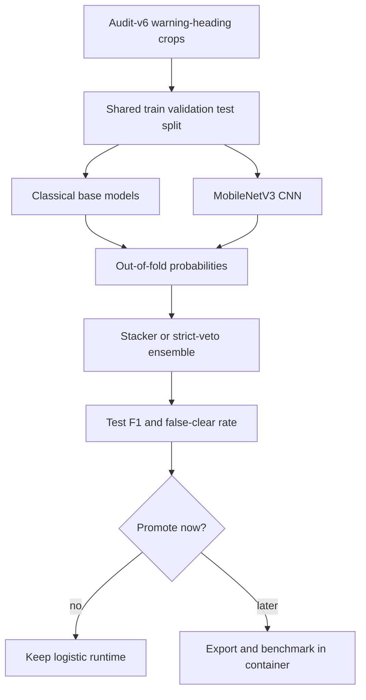
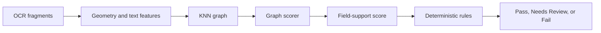

# Trade-Offs

This file records the decisions that matter for evaluating the submission. It
does not include the full sprint log.

## 1. Local-First OCR

**Decision:** Use local OCR instead of hosted OCR/ML APIs.

**Why:** The stakeholder notes warned that outbound network calls were blocked
during a prior vendor pilot. Local OCR also gives a cleaner federal prototype
story: no label images leave the VM at runtime.

**Cost:** Local OCR increases container size and model warmup time.

## 1.1 Curated Public Demo Pack

**Decision:** Use a curated, server-hosted public-COLA demo pack for the live
walkthrough at `/public-cola-demo`.

**Why:** The raw public COLA corpus contains many hard OCR edge cases: vertical
warning text, curved panels, low-resolution panels, and multi-panel layouts
where strict warning extraction can fail even for approved labels. For the live
interview demo, the app needs a stable green path that shows the intended
workflow: application truth fields, parsed label evidence, queue progress,
review-policy controls, and reviewer action buttons.

**Implementation:** `scripts/create_curated_public_cola_demo_pack.py` exports
300 new public-COLA applications into
`data/work/demo-upload/public-cola-curated-300/`. The pack includes valid image
panels plus curated OCR/typography sidecars. The server demo route uses those
sidecars first, then falls back to local OCR if a sidecar is missing.

**Boundary:** This pack is not an accuracy metric. It is a walkthrough artifact.
Model-performance claims must come from the evaluation corpus and holdout
statistics, not this curated demo cache.

## 1.2 Final Demo UX Versus Measurement UX

**Decision:** Separate the live evaluator walkthrough from the statistical
measurement path.

**Why:** The project prompt asks for a working prototype that can be accessed
and tested. Public COLA data is real and useful, but it also contains hard image
layouts that are not all solved in this deadline window. The final app therefore
has two clear paths:

- `LOT Demo`: a server-hosted, curated public-COLA walkthrough that shows the
  end-to-end flow with 300 applications, multiple panels per application,
  actual application values, scraped label values, review routing, reviewer
  decisions, progress, timing, and CSV export.
- `LOT Actual`: a user-upload path where an evaluator can upload one application
  folder or a folder of applications using the documented manifest format.

**Cost:** The curated demo pack uses cached OCR/typography sidecars when
available. That makes the live walkthrough stable, but it must not be confused
with a model benchmark.

**Benefit:** This keeps the interview demo reliable while preserving the honest
measurement story in `MODEL_LOG.md`, `docs/performance.md`, and this file.

## 2. Deterministic Rules Decide Compliance

**Decision:** Compliance outcomes come from source-backed deterministic rules,
not from a language model.

**Why:** The core work is field matching and strict warning validation. A model
can support evidence scoring, but final `Pass`, `Needs Review`, and `Fail`
should be explainable.

## 3. DistilRoBERTa as Evidence, Not Authority

**Decision:** Wire DistilRoBERTa as an optional field-support arbiter.

**Why:** It improves the evidence layer by scoring whether a candidate text
fragment supports a target field. It does not replace OCR and does not make
legal decisions.

Measured clean field-pair results:

| Split | Examples | F1 | False-clear rate |
|---|---:|---:|---:|
| Train | 31,008 | 1.000000 | 0.000000 |
| Validation | 15,417 | 1.000000 | 0.000000 |
| Locked holdout | 46,992 | 0.999904 | 0.000096 |

Important limitation: these statistics come from weakly supervised clean
field-pair data, not fully noisy OCR text. They are useful evidence that the
bridge can learn field support, but they are not a final OCR accuracy claim.

## 4. Government-Warning Typography

**Decision:** Use a narrow classical model for `GOVERNMENT WARNING:` boldness.

**Why:** The problem is small and visual: classify an isolated warning-heading
crop as confidently bold or not confidently bold. The deployed model is a
JSON-exported logistic classifier using engineered image features. It is easy to
inspect, fast on CPU, and does not require scikit-learn at runtime.

Measured operating point:

| Metric | Value |
|---|---:|
| Selected threshold | 0.9546 |
| Validation false-clear rate | 0.000624 |
| Synthetic holdout false-clear rate | 0.001800 |
| Held-out approved-COLA clear rate | 92.19% |
| Real COLA sanity latency | about 37 ms crop + classify |

Safety posture: if the crop is weak, missing, blurry, or below threshold, the
app routes to `Needs Review`. It does not auto-reject based on typography alone.

## 5. CNN and Ensemble Typography Models

**Decision:** Keep CNN-inclusive typography ensembles offline for now.

**Why:** They are promising, but promoting them on deadline would add runtime
complexity and more artifact management. The smaller logistic model is already
wired and conservative.

The ensemble experiment was intentionally built as a fair same-dataset
comparison. Classical models and the CNN were trained on the same audit-v6 split,
then stackers and reject policies were evaluated on the same test split.

Best useful offline results:

| Model / Policy | Test macro F1 | Test false-clear |
|---|---:|---:|
| MobileNetV3 CNN base | 0.9686 | 0.0055 |
| Logistic stacker, all bases + CNN | 0.9908 | 0.0099 |
| LightGBM reject, all bases + CNN | 0.9552 | 0.0033 |
| XGBoost reject, all bases + CNN | 0.9656 | 0.0044 |

These results are documented for future promotion, not claimed as the live app.

## 6. Batch Queue

**Decision:** Implement a local filesystem-backed durable queue instead of
Celery/Redis.

**Why:** The app needs credible 200-300 item batch behavior, but the submission
does not need a full production worker cluster. The queue writes `queue.json`,
returns immediately, processes work in a local worker thread, and recovers
interrupted running jobs as queued on startup.

**Cost:** This is single-VM durability, not production distributed processing.

Production path: broker-backed worker queue, separate worker container,
PostgreSQL, audit logging, and role-based access.

## 7. ZIP Upload

**Decision:** Accept ZIP archives only for manifest-backed image batches.

Guardrails:

- archive size limit,
- batch item limit,
- image extension allowlist,
- magic-byte validation,
- Pillow decode validation,
- per-image size limit,
- randomized stored filenames,
- manifest-to-image reconciliation,
- ZIP paths flattened to basenames.

Production path: malware scanning, quarantine handling, retention policy, and
authenticated upload controls.

## 8. Reviewer Dashboard Without Login

**Decision:** Add `/review` as a queue dashboard without authentication.

**Why:** The take-home needs to show the review workflow. Building auth, roles,
and an admin portal on deadline would be security theater.

Production path: SSO, RBAC, audit logs, immutable reviewer actions, and
retention controls.

## 9. Production Hardening Freeze

**Decision:** Document the remaining production-hardening work instead of
changing the live runtime after the app was verified.

**Why:** The deployed prototype already demonstrates the assignment's core
requirements: local OCR, deterministic rule checks, batch review, reviewer
queues, CSV export, public-COLA examples, and measured model experiments. The
remaining security and operations items are important, but they touch container
permissions, proxy behavior, request handling, persistence, and deployment
health checks. Changing those after the demo path is working would create more
submission risk than value.

Deferred hardening items:

- run the container as a non-root user after validating mounted volume
  ownership on the host,
- add Dockerfile and Docker Compose healthchecks against `/health`,
- add Caddy security headers and rate limiting,
- schedule `data/jobs/` cleanup,
- add authentication and role-based reviewer access,
- move reviewer decisions to an append-only audit log,
- validate every job, item, and upload path through one shared path-safety
  module,
- promote the local queue to a broker-backed worker service before horizontal
  scaling.

This is a scope-discipline choice, not a dismissal of those controls.

## 10. Graph Scorer Deferred

**Decision:** Do not deploy the graph-aware evidence scorer.

**Why:** The proof of concept is promising, especially for curved or fragmented
label text, but it needs a saved runtime artifact, same-split comparison against
DistilRoBERTa, CPU latency proof, tests, and locked-holdout evaluation.

The graph scorer is the practical future version of the curved-text idea. It
uses OCR fragments as graph nodes instead of trying to train a new pixel-to-text
OCR model during the submission window.

Useful POC result:

| Model | F1 | False-clear rate |
|---|---:|---:|
| Baseline fuzzy matcher | 0.7714 | 0.0439 |
| Graph-aware scorer POC | 0.8489 | 0.0175 |

This is a good post-submission branch, not a Monday runtime feature.

## 11. Remaining Limits

- The app is a prototype, not an official TTB system.
- Auth/admin/roles are intentionally not implemented.
- The strongest field-support results are clean text-pair results.
- A full noisy OCR locked holdout evaluation remains future work.
- Public COLA data is used for calibration and demonstration; private COLAs
  Online data is not accessed.
